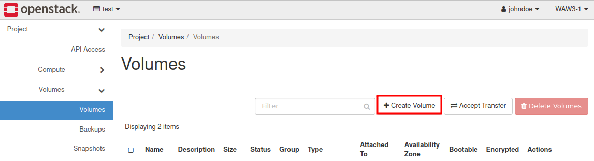
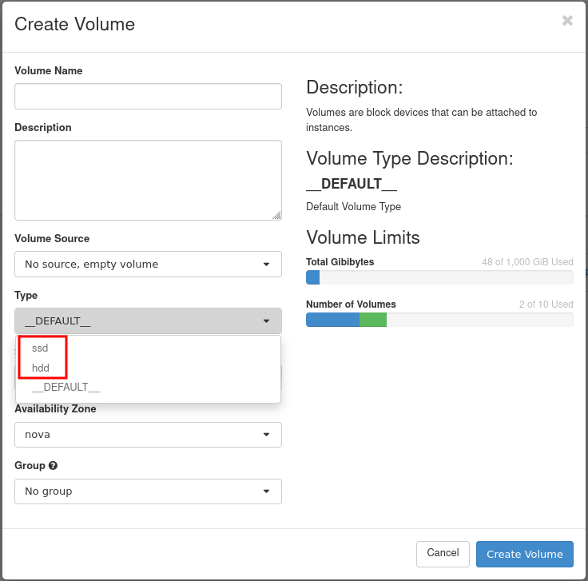

How to attach a volume to VM (<2 TB) on Linux?
==============================================

If the volume does not exist yet, it must be created. Go to Horizon, „`volumes” <https://horizon.cloudferro.com/project/volumes/>`_, click „create volume”. Give it an appropriate name, select size and disk type (either HDD-default or SSD).

Now, from the volume menu, select „manage attachments” and attach the volume to the desired instance. It becomes visible in it as a block device, like /dev/vdb or /dev/sdb (depending on what disk type we choose).

If the volume had not been used before (it has been freshly created), it must be first partitioned and formatted, e.g

|

::

   $ sudo fdisk /dev/vdb
   Command (m for help): n
   
   Partition type
   p primary (0 primary, 0 extended, 4 free)
   e extended (container for logical partitions)
   Select (default p):<ENTER>
   Using default response p.
   Partition number (1-4, default 1): <ENTER>
   First sector (2048-104857599, default 2048): <ENTER>
   Last sector, +sectors or +size{K,M,G,T,P} (2048-104857599, default 104857599): <ENTER>
   Created a new partition 1 of type 'Linux' and of size 50 GiB.
   Command (m for help): w
   
   The partition table has been altered.
   Calling ioctl() to re-read partition table.
   Syncing disks.
   
   $ lsblk /dev/vdb
   $ sudo mkfs.ext4 /dev/vdb1
   
Previously used volume (moved from other VM) is usually already partitioned and formatted.

Now mount the volume in the system. Edit /etc/fstab with 'sudo' and using your favourite editor (nano, vim) to add the line

::

   /dev/vdb1 /my_volume ext4 defaults 0 1
   
and create a mounting point, then mount it.

::
   
   $ sudo mkdir /my_volume
   $ sudo mount /my_volume

On the next reboot, the volume will be mounted automatically. Volumes may be attached to live system, without the need to reboot it.
