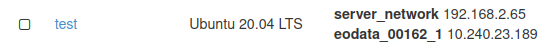

How to access Earth Observation Data (EODATA)?
==============================================

EODATA folder is automatically mounted when your VM is spawned.
To access it you have to make sure that "eodata_*your-projectID*" interface is attached to VM.

After that, the whole EODATA folder should be accesible on "/eodata". 

To list it's content you can use following command

.. code-block:: 
    
   eouser@vm01:~$ ls -a /eodata
    

