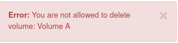

Volume snapshot inheritance and its consequences
=============================================================
Performing a volume snapshot is a common form of securing your data against loss.
There is nothing wrong with that, but you should remember what the consequences are.

To illustrate the situation, we will present it on an example:
We have created a "Volume A" volume.

Next we create a "SA" snapshot from the "VA" volume.

From the OpenStack dashboard we can create new volumes "Volume B" and "Volume C" based on previously created snapshot "Snapshot A".

At the moment we have two new volumes which are based on the "Snapshot A" snapshot. Suppose we no longer need the "Volume A" volume and we want to delete it.

Unfortunately, delete will not be possible directly because to delete a given volume, we have to delete its snapshots.

So we must first delete the snapshot "Snapshot A", then the volume "Volume A".

However, this also will not be possible due to the fact that the "Snapshot A" snapshot is the source for 2 volumes "Volume B" and "Volume C".

To delete a volume from which snapshots volumes were created, we must also delete all snapshots of this volume.

In conclusion, when creating new volumes from a snapshot, remember about inheritance. Snapshot "Snapshot A" is a parent for the volumes (children) "Volume B" and "Volume C" and if we want to delete the volume "Volume A" we have to do it from the youngest generation (Volume B and Volume C).

 

Another solution are Backups, which do not create such bonds as snapshots and may exist even after the volume from which the backup was created has been deleted.
