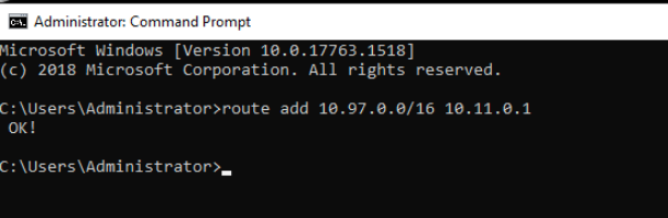
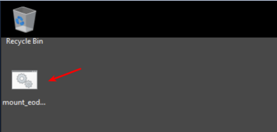

Can't access eodata
===================

If you have problems with access to eodata try the following:

 
Install *arping*:

in CentOS:

.. code::

  sudo yum install arping

in Ubuntu:

.. code::

  sudo apt install arping

check the name of the interface connected to eodata network:
.. code::

  ifconfig

based on the response, find the number of  the interface of 10.111.x.x (eth<number> or ens<number>)

after that invoke the following commands:

in CentOS:

.. code::

  sudo arping -U -c 2 -I eth<number> $(ip -4 a show dev eth1 | sed -n 's/.*inet \([0-9\.]\+\).*/\1/p')

in Ubuntu:

.. code::

  sudo arping -U -c 2 -I ens<number> $(ip -4 a show dev ens4 | sed -n 's/.*inet \([0-9\.]\+\).*/\1/p')

Next ping data.cloudferro.com again. If you receive answers, remount the resource:

.. code::
 
  sudo umount -lf /eodata
 
  sudo mount /eodata

In the instances created after **March 14, 2020,** /eodata is automatically mounted after adding the "eodata" Network to your VM.

The /eodata mount runs as a service and can be restarted by executing the command:

.. code::

  sudo systemctl restart eodata.mount

and status can be checked by executing:

.. code::

  sudo systemctl status eodata.mount

In the instances created **before March 14, 2020,** /eodata is mounted using the /etc/fstab file and can be remounted by executing commands below:

.. code::

  sudo umount -lf /eodata
 
  sudo mount /eodata
  

In Windows:

Run CMD (Command Prompt) with administrator privileges.

Open START menu and type "CMD". Right click on the top result and select Run as Administrator.

Type:

.. code::

  route add 10.97.0.0/16 10.11.0.1

and confirm by pressing Enter.

The run script "mount_eodata" from desktop.

