Remote Transfer for EODATA - Create Credentials
===============================================

Prerequisites

An active Creodias account is required. If you don’t have an account, read the article `How to register to Portal <https://creodias.eu/-/a-9-38>`_?

Please log in to `https://creodias.eu/ <https://creodias.eu/>`_ and send the request to CloudFerro Sales Department.

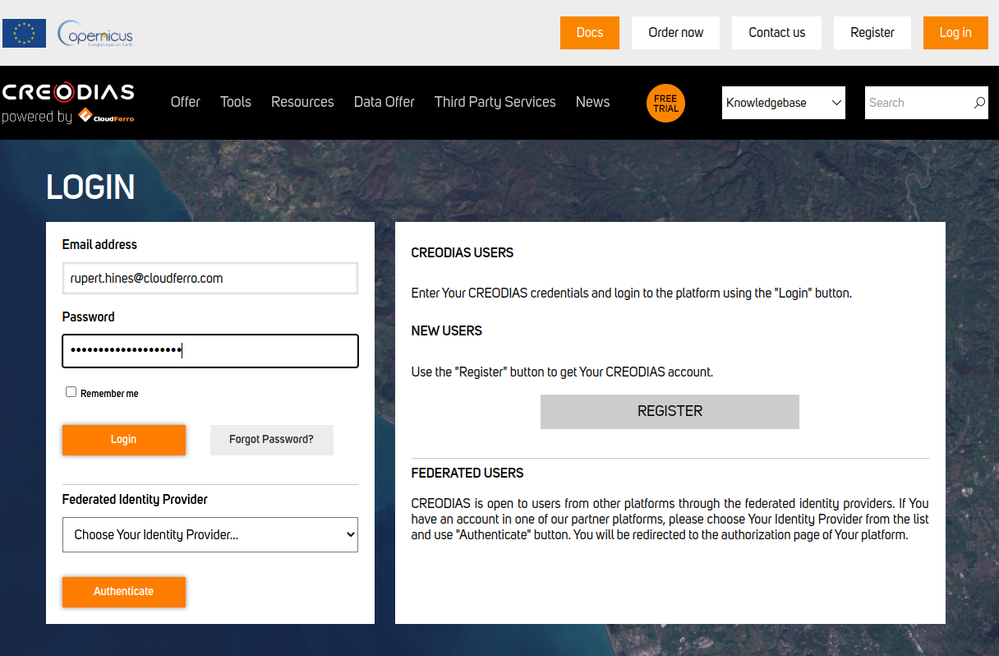

choose "My Account" -> "Account Home"

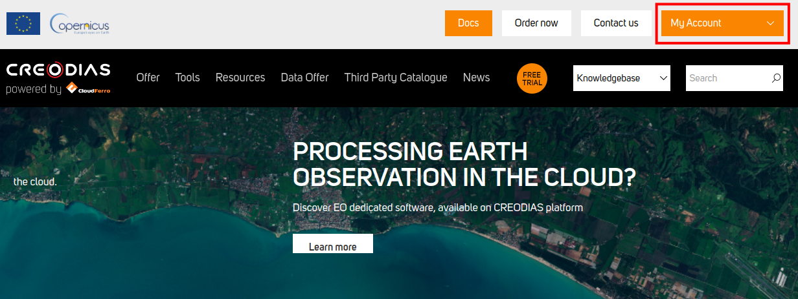

click on "Support"

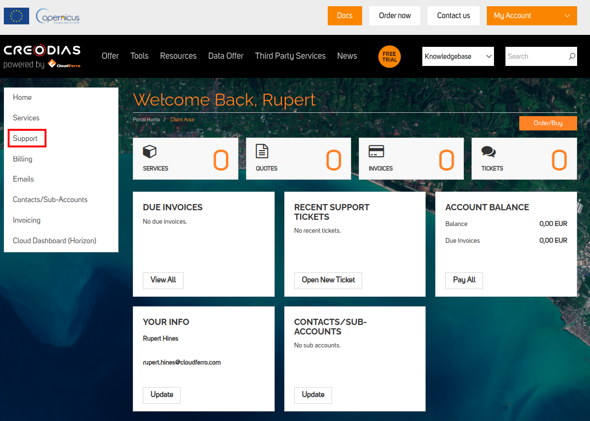

and send the request to CloudFerro Sales Department by clicking on "Submit New Ticket"

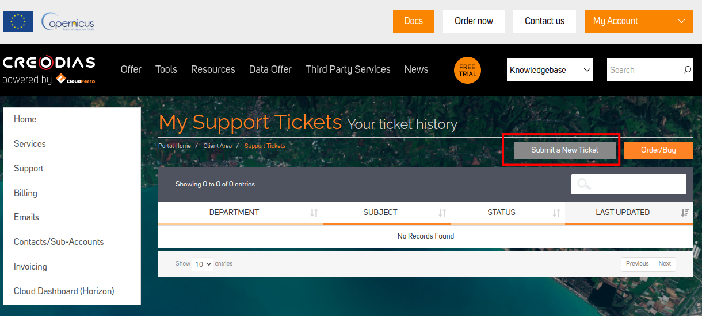

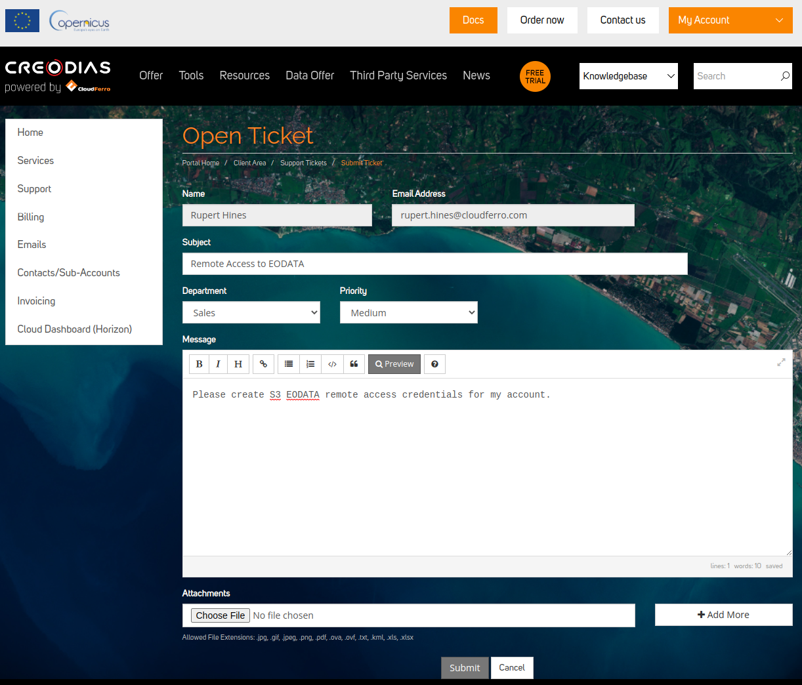

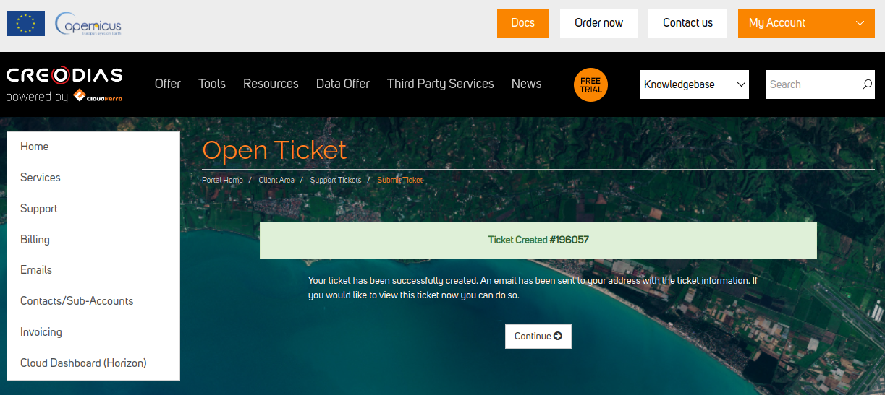

Now go to `https://clients.creodias.eu/panel/credentials <https://clients.creodias.eu/panel/credentials>`_. You will see the following screen:

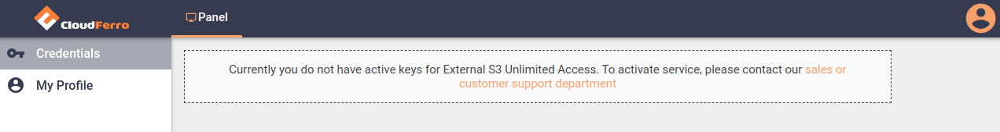

after receiving positive response from CloudFerro Sales Department please log in to `https://clients.creodias.eu/login <https://clients.creodias.eu/login>`_

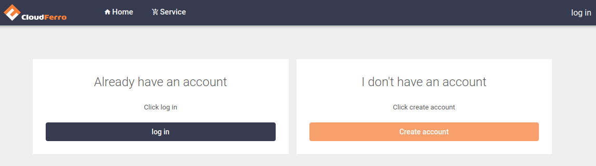

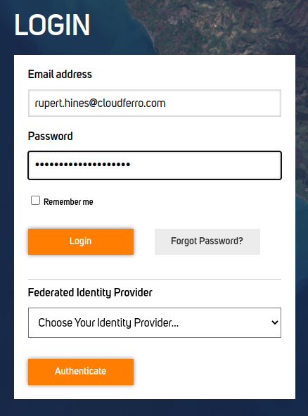

You will see:

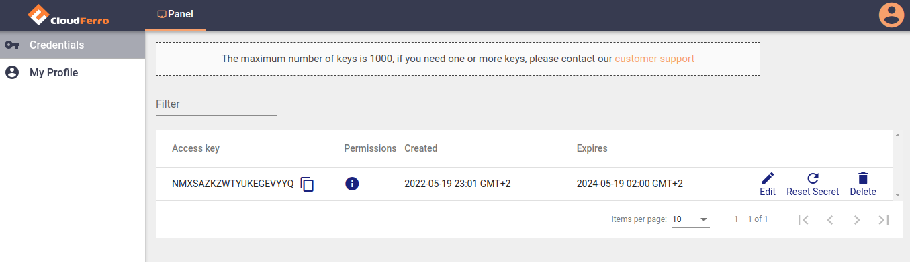

click on "Reset Secret"

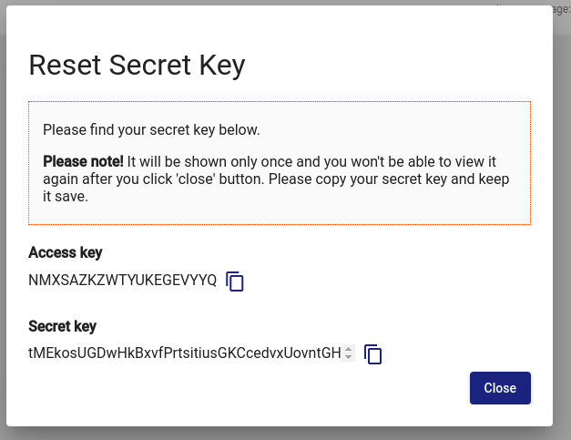

and copy "Access key" and "Secret key"

