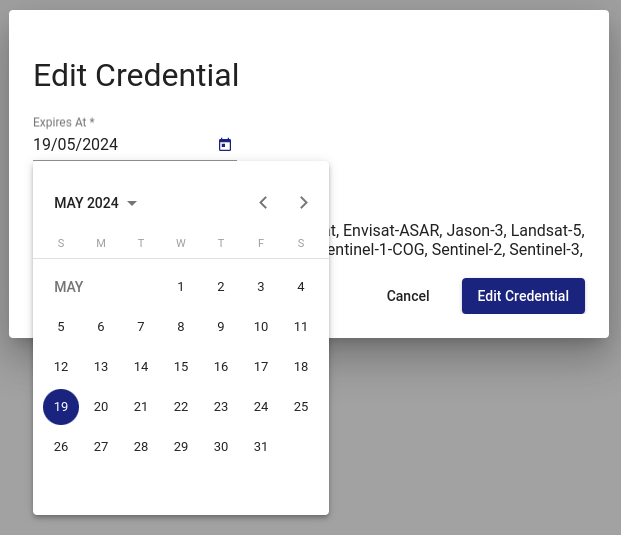

Remote Transfer for EODATA - Extend the Validity of Credentials
===============================================================

Prerequisites

An active Creodias account is required. If you don’t have an account, read the article `How to register to Portal <https://creodias.eu/-/a-9-38>`_?
CloudFerro Remote Transfer for EODATA credentials have already been created (see: `Remote Transfer for EODATA - Create Credentials <https://cloudferro-cf3.readthedocs-hosted.com/en/latest/eodata/remote-access-create-credentials/remote-access-create-credentials.html>`_).

Log in to `https://clients.creodias.eu/login <https://clients.creodias.eu/login>`_

Go to Panel - Credentials

Click on "Edit"

Choose new date:

Click on "Edit Credential"

You will see new expiry date:

