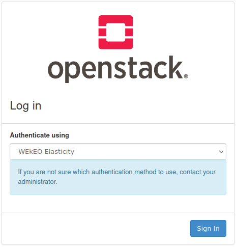
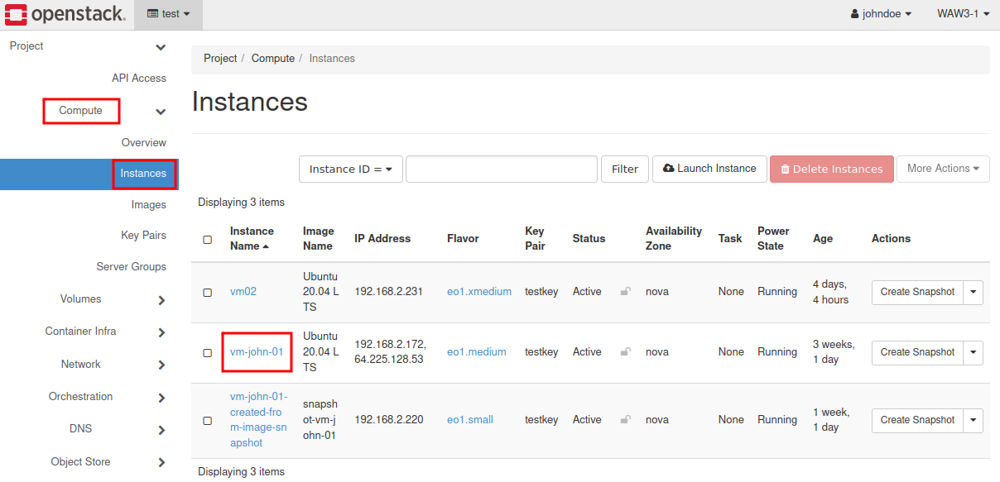
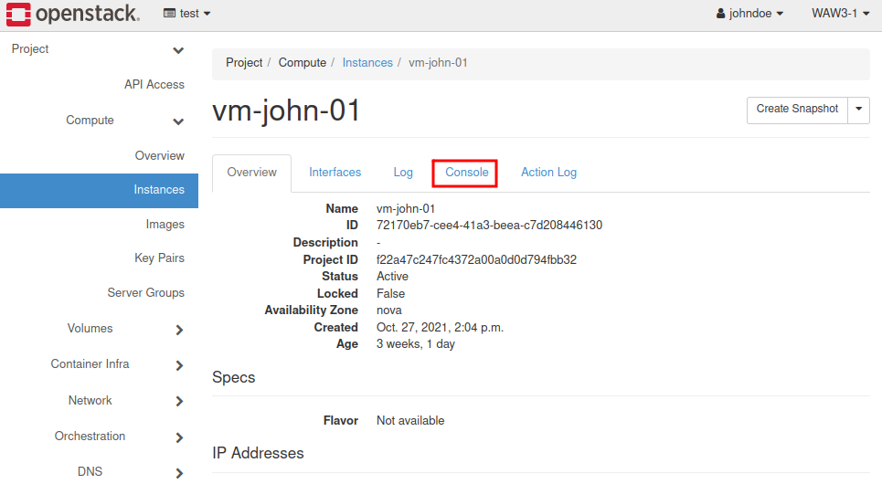
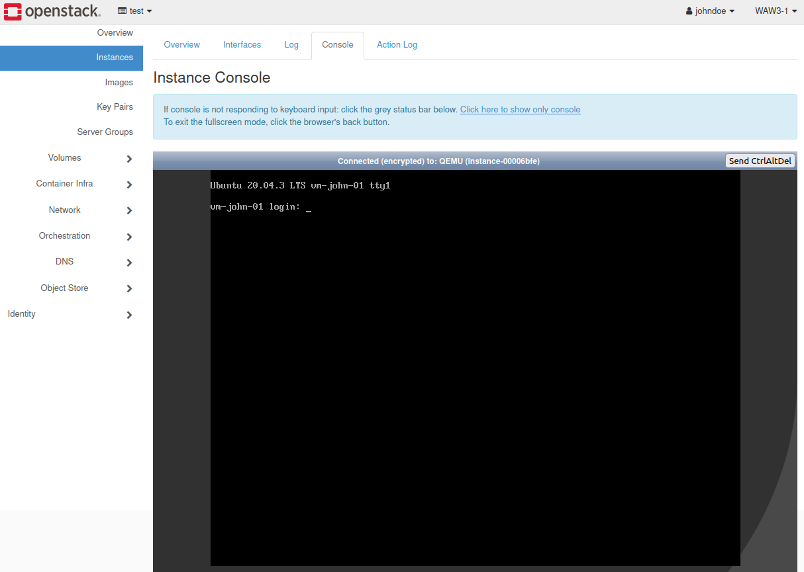
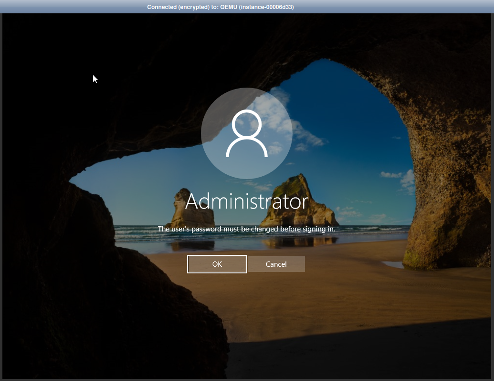

How to access the VM from OpenStack console?
============================================

.. attention::

   We recommend not using Chrome browser because it responds very slowly while using the OpenStack console. Firefox works well.
   
1. Go to https://horizon.cloudferro.com/auth/login/?next=/ and select your authentication method.
 

2. Choose **Compute/Instances** pane and select desired VM by clicking on its name:

3. Select **"Console"** pane

4 a) Enter login: **eoconsole** in case of **Linux** (if you are logging in at the first time, you will be asked for setting up new password)

4 b) In case of **Windows** set up password for Administrator profile

5. You can now perform administrative tasks in the instance.
