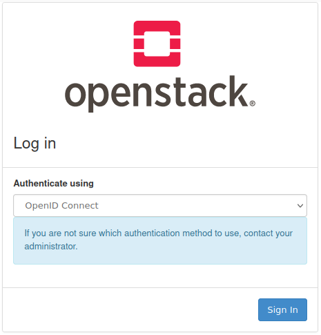
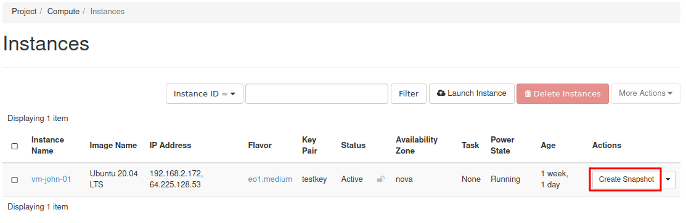
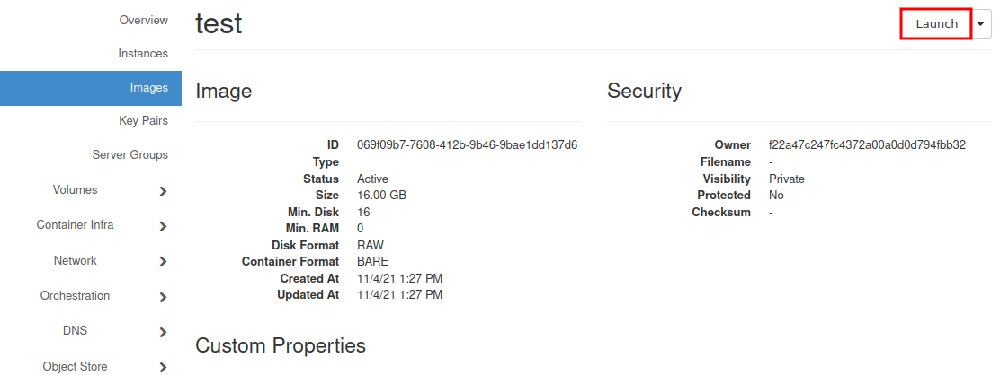

How to clone existing and configured VMs?
==========================================

The simplest way to create the snapshot of your machine is using "Horizon" - graphical interface of OpenStack dasboard.

In summary, there will be 2 operations:

1. Creating snapshot

2. Restoring snapshot to newly creaded VM.

 

To start, please visit our website https://horizon.cloudferro.com and login.

After logon, in **"Instances"** menu select VM to be cloned, and create its snapshot by clicking "Actions" Menu

Once the snapshot is ready, you may see it on **„Images”** page of Horizon. Select its name to see properties.

Now, you may click **"Launch"** in right upper corner of the window or just go back to **„Instances”** menu and launch new instance.

Full manual you may find here:

`HOW TO CREATE NEW LINUX VM IN OPENSTACK DASHBOARD (HORIZON)? <https://cloudferro-cf3.readthedocs-hosted.com/en/latest/general/newlinuxvm/newlinuxvm.html>`_
 

But if this process is familiar to you, there is only one difference. Chose as the source **"boot from snapshot”** instead of **"boot from image"** and select your snapshot from the list below. In next steps select parameters (flavour, size), at least the same as the original one. ("Launch instance" button will be unavailable untill all necessary settings were completed).

The new machine gets configured as a clone of the original one, except of network addresses (new floating-ip must be associated) and network policies.

.. caution::

   if the original machine had any additional volumes attached to it, they also should be cloned.

You may also want to read:

`VOLUME SNAPSHOT INHERITANCE AND ITS CONSEQUENCES <https://cloudferro-cf3.readthedocs-hosted.com/en/latest/datavolume/volumesnapshotinheritanceanditsconsequences/volumesnapshotinheritanceanditsconsequences.html>`_
