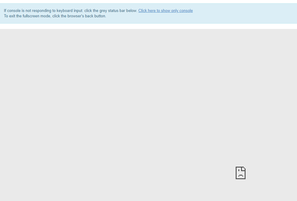

How to fix unresponsive console issue?
======================================

When you create a new virtual machine, the first thing you would like to do is to seek into console panel and check if the instance has booted correctly.

After entering console you might encounter these symptoms:

* unresponsive grey screen
* document icon in the down-right corner which informs about the issue on client side.

   
|   
 
**In this case:**

check your firewall rules for port 6082 and assign "incoming" traffic to "allow" rule.

 
**For connecting through RDP:**

Be assured that you excluded your floating IP for the RDP rules on your computer. If you want to proceed the consistent change for more than one machine then exclude our external network address: 185.178.84.0/22.

