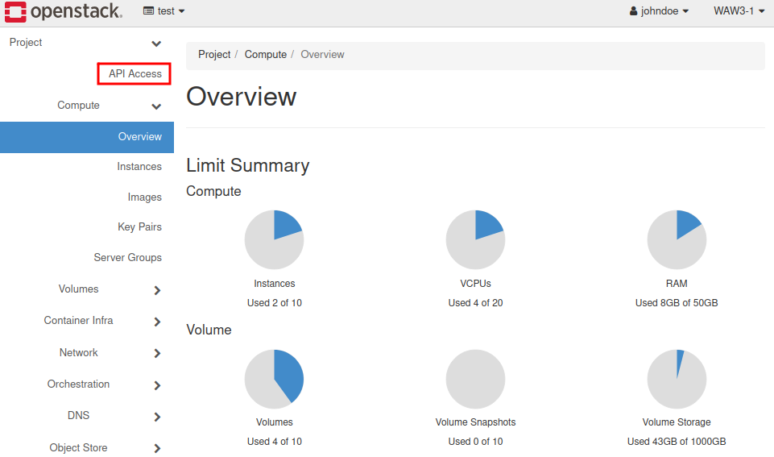
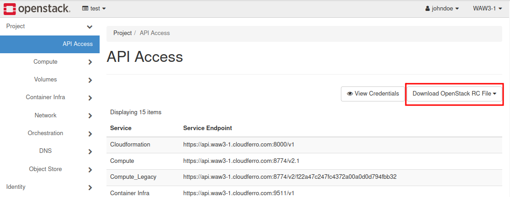
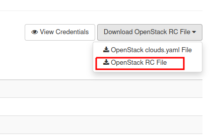

How to generate ec2 credentials?
================================

Before you attempt to perform the CLI operations, please assure that `Python-openstackclient <https://cloudferro-cf3.readthedocs-hosted.com/en/latest/openstackcli/openstacklinux/openstacklinux.html>`_ has been installed.

EC2 are being used in getting access to the private bucket.
Users are able to generate ec2 credentials on their own by following those steps:

Log in to the Horizon Panel and click on the **API Access** in the Project branch.

   

Click on the **Download OpenStack RC File**:

|

Choose **OpenStack RC File**:

|

Save your file on the hard disk and open your Terminal.

Type in commands presented below.

Virtual environment called **"openstack"** has been created for the FAQ purposes and consists of python-openstackclient packages.

::

   user@station:~$ source test/test-openrc.sh
   Please enter your OpenStack Password for project test as user john.doe@cloudferro.com:
   user@station:~$ source openstack_cli/bin/activate
   (openstack_cli) user@station:~$ openstack ec2 credentials create

Output:

::

   +------------+-------------------------------------+
   | Field      | Value                               |
   +------------+-------------------------------------+
   +--------------------------------------------------+
   | access     | [access key]                        |
   | links      | [link]                              |
   | project_id | db39778a89b242f0a8ba818eaf4f3329    |
   | secret     | [secret key]                        |
   | trust_id   | None                                |
   | user_id    | 121fa8dadf084e2fba46b00850aeb7aa    |
   +------------+-------------------------------------+
   
 
Save access and secret key value.

In the case of failure, you may grant access to your credential record by typing in command:

::

   (openstack_cli) user@station:~$ openstack ec2 credentials list

   +--------------------+------------------------+-------------------+---------------+
   | Access             | Secret                 | Project ID        | User ID       |
   +--------------------+------------------------+-------------------+---------------+
   | [access key]       | [secret key]           | [project id]      | [user id]     |
   +--------------------+------------------------+-------------------+---------------+
   
 
 

