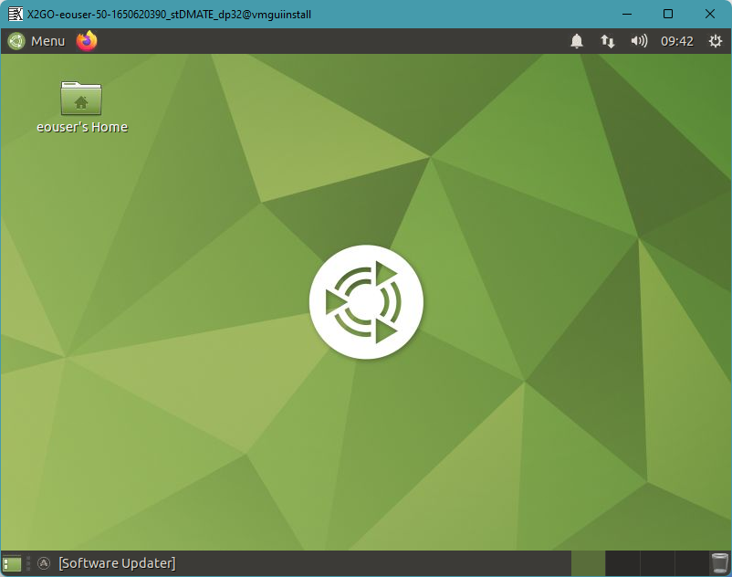
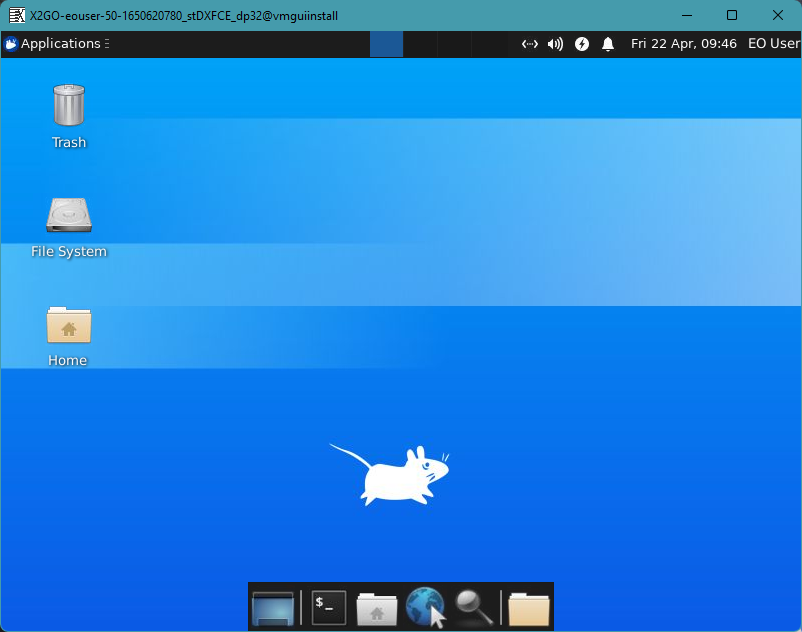
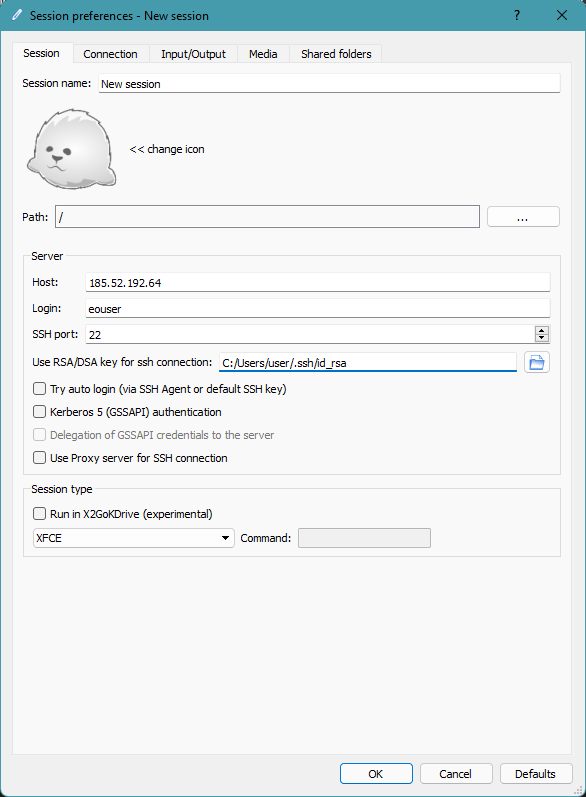
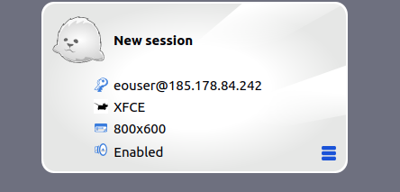

How to use GUI in VM with Linux?
=================================

Desktop environments for Linux allow you to perform any action related to your operating system in visible way. Its purpose is to deliver a proper suite in terms of look, functionnalities, and usability.

In order to install GUI for basic Ubuntu images we have to consider some tasksel installations. We have prepared two environments 
that interact correctly with the recommended visual remote desktop application -x2GO.

Tutorial has been prepared on machine with preinstalled Ubuntu 20.04.

**1. Mate**

.. code-block:: bash

   sudo apt-get update
   sudo apt upgrade
   sudo apt install tasksel
   sudo reboot
   sudo tasksel install ubuntu-mate-desktop
   
Theme for Mate:

   
   
**2. XFCE**
   
.. code-block:: bash

   sudo apt-get update
   sudo apt upgrade
   sudo apt install tasksel
   sudo reboot
   sudo tasksel install xubuntu-desktop
   
Theme for XFCE:

   
   
**What is X2GO?**

Simply, X2GO is one of the many solutions for Remote Desktop that works well over either low or high bandwith.
For more informations, I reffer to the documentation: https://wiki.x2go.org/doku.php/doc:newtox2go

**X2GO configuration**

Using SPICE console within the Horizon panel may effect in worse optimalization and non-synchronized cursor. To improve the whole setup we may install X2GO server on the virtual machine and X2GO client on our computer which is being used to connect to our instance.

Operations on the virtual machine:

.. code-block:: bash

   sudo apt-get install software-properties-common
   sudo add-apt-repository ppa:x2go/stable
   sudo apt-get update
   sudo apt-get install x2goserver x2goserver-xsession
   
Operations on the client side:

.. code-block:: bash

   sudo apt-get install x2goclient
   
Ok, we are equipped to initialize our first session. Launch X2GO application and look on the prompt window

   
**Fill in necessary blanks:**

* host: IP of the virtual machine
* Login: eouser ( account allowed for ssh connection)
* SSH port 22 (by default)
* Session type: in this case **MATE** or **XFCE** (it depends what have you installed)
* RSA/DSA key for ssh connection: Directory of your private key

Press “OK”

Notice a rectangle with curved edges on your right side. Click on it.

If every value in the step before was typed in correctly, you should encounter a window with information: Established X server connection.
Few seconds after that you obtain a visible access to your virtual machine.
   
   
  

