How To Create a New Linux VM With NVIDIA Virtual GPU in Openstack Dashboard (Horizon)?
========================================================================================

You can create Linux virtual machine with NVIDIA RTX A6000 as the additional graphics card. The card contains

  * 10,752 CUDA cores for rendering, graphics operations and heavy parallel computations,

  * 336 Tensor cores which accelerate AI and data science model training, while 

  * 84 RT cores speed up ray tracing with shading or denoising, photorealistic rendering and so on. 

There are four variants, using 6, 12, 24, or 48 GB of VGPU RAM. You will be able to select the particular model by choosing a proper flavor when creating the instance in Horizon (see below). 

What We Are Going To Cover
--------------------------

 * How to create an instance with NVIDIA support

 * How to choose the proper flavor for the data in hand

 * How to add proper keypair in order to 

 * SSH into the virtual machine you create, or

 * use the console within Horizon interface and

 * verify that you are using the NVIDIA vGPU. 

Step 1 Create New Instance with NVIDIA Image Support
----------------------------------------------------

To define a new instance, use the following series of commands:

 **Project → Compute → Instances.**

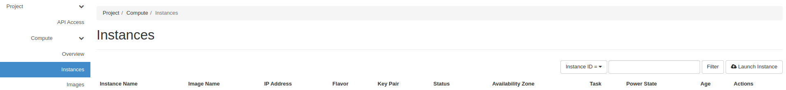

Click **Launch Instance** to get the following screen:

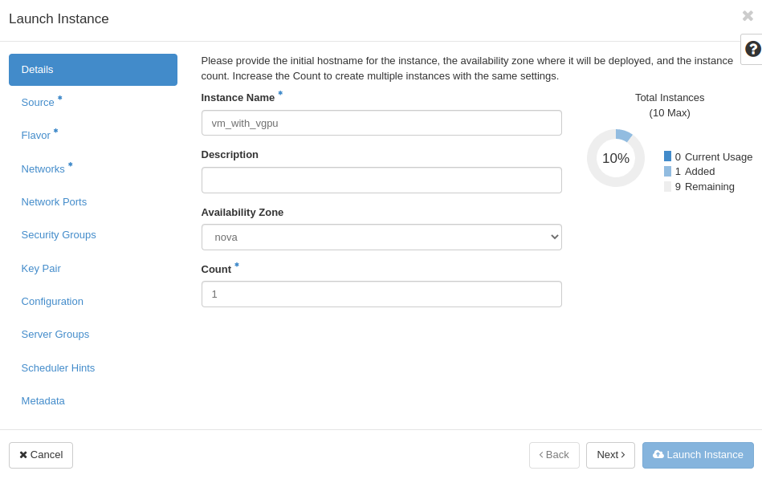

Insert the name of the instance (eg. "vm_with_vgpu") and click Next button. In the next screen, you will choose the operating system for the new virtual machine you are defining:

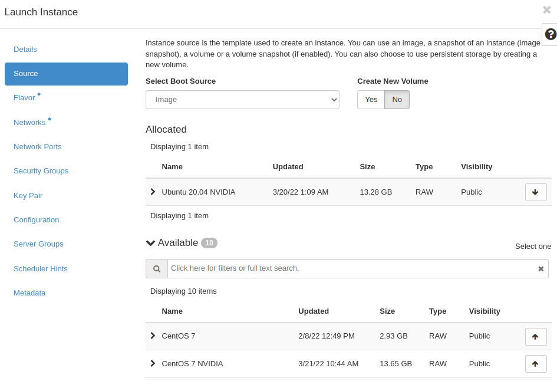

Your goal is to use an image with predefinced NVIDIA support. To list all such images, click on field **Available** and enter 'NVIDIA' into it. Only the images with NVIDIA in their names will be listed:

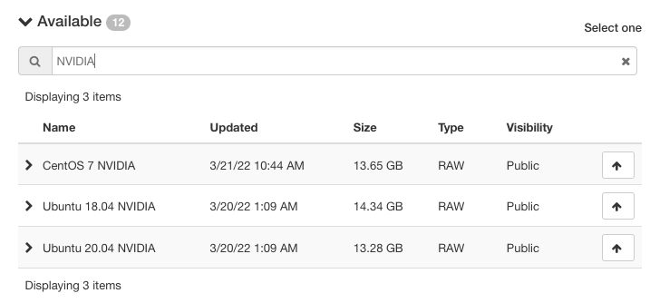

Select Instance Boot Source (eg. "Image"), and choose desired image (eg. "Ubuntu 20.04 NVIDIA") by clicking on arrow.

Images marked with "NVIDIA" are fully operational. They come preinstalled with

 * special NVIDIA Grid drivers 

 * a licence token, as well as

 * the CUDA library.

.. note::

   If you do not need to have the system disk bigger than the size defined in a chosen flavor, we recommend setting "Create New Volume" feature to "No" state.

Click on the Next button and get to the following screen:

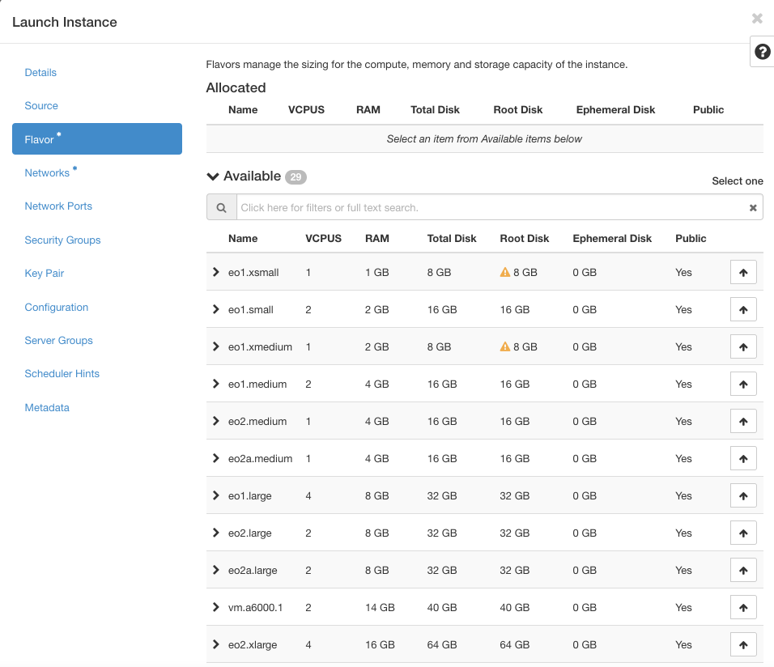

You will now choose one of the four models of the RTX A6000 card. 

Step 2 Select Card Model / Flavor
---------------------------------

There four models: **RTXA6000-6C**, **RTXA6000-12C**, **RTXA6000-24C**, and **RTXA6000-48C**, are defined in this table:

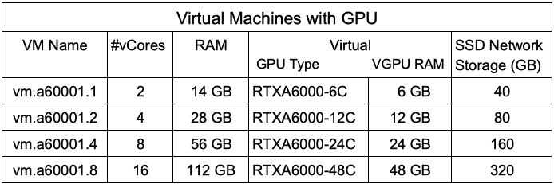

The column VM Name contains flavor names *vm.a6000.1*, *vm.a6000.2*, *vm.a6000.4*, *vm.a6000.8*. Again, type *a6000* into the field **Available** and list only the NVIDIA flavors:

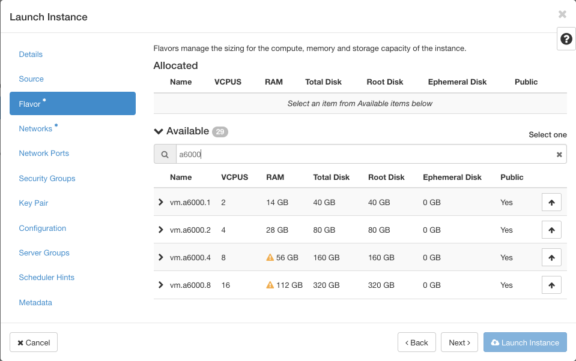

Taking into account the data from the table above, if you select flavor *vm.a6000.2*, you will use **4** virtual cores and **28** GB of "normal" RAM, and simultaneously, you will also choose the **RTXA6000-12C** model with **12** GB of virtual GPU RAM. 

.. note::
 
   Yellow triangles in the listing mean that you cannot select that row as one of the system resources is already engaged to other instances. If you, say, wanted to select the strongest flavor of NVIDIA, *vm.a6000.8*, you would first have to obtain 112 GB or more of available of RAM and only then  be able to opt for that flavor.

In the situation above, select *vm.a6000.2* and continue going through the usual motions of selecting instance elements to finish the procedure. 

Step 3 Finish Creating the Instance
-----------------------------------

Click "Networks" and then choose desired networks.

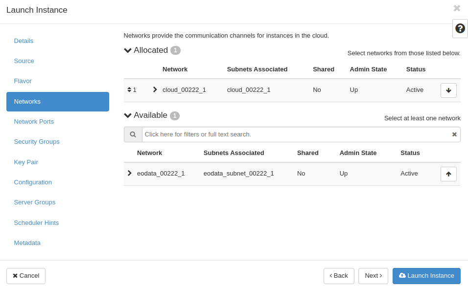

Open "Security Groups" After that, choose "allow_ping_ssh_icmp_rdp" and "default".

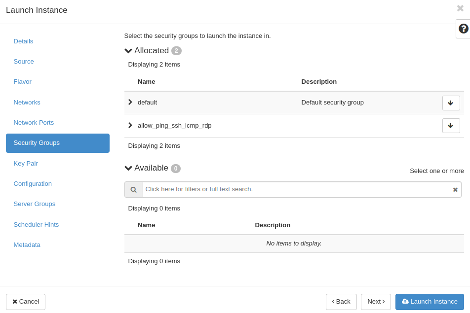

Choose or generate SSH keypair, as is explained in article `HOW TO CREATE KEY-PAIR IN OPENSTACK DASHBOARD? <https://cloudferro-cf3.readthedocs-hosted.com/en/latest/general/keypairopenstack/keypairopenstack.html>`_ for your VM. Next, launch your instance by clicking on blue button.

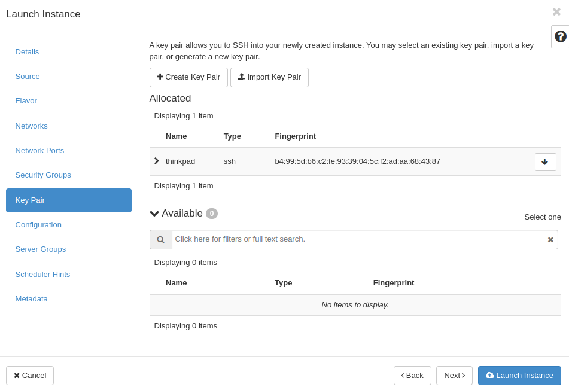

You will see "Instances" menu with your newly created VM.

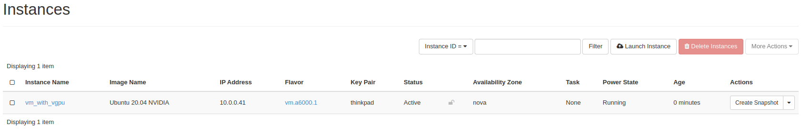

.. note::

   If you want to make your VM accessible from the Internet `click here to add a floating IP address to the generated instance <https://cloudferro-cf3.readthedocs-hosted.com/en/latest/networking/addremovefip/addremovefip.html>`_.

Step 4 Issue Commands from the Console
--------------------------------------

Open the drop-down menu and choose "Console".

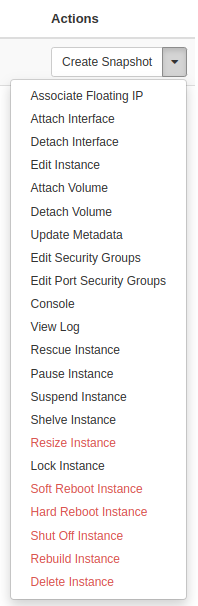

You can connect to your virtual machine using SSH. `How to connect to your virtual machine via SSH in Linux? <https://cloudferro-cf3.readthedocs-hosted.com/en/latest/networking/connectviasshlinux/connectviasshlinux.html?highlight=ssh>`_

You can also use the SPICE console using the Openstack Dashboard.
Click on the black terminal area (to activate access to the console). Type: 

.. code::

   eoconsole 

and hit Enter on the keyboard.

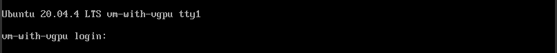

Insert and retype new password.

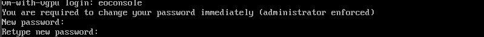

Now you can type commands. 

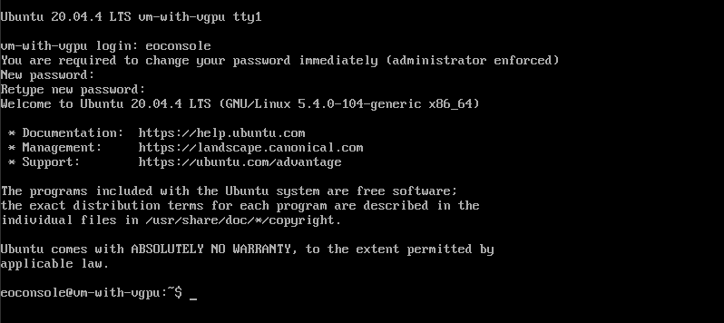

To check the status of the **vGPU** device, enter the command: 

.. code:: 

   nvidia-smi

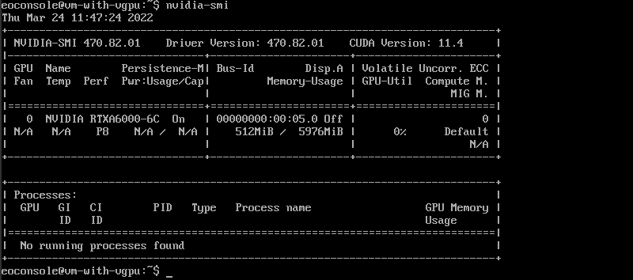

After you finish, type "exit".

.. code::

   exit

This will close the session.
