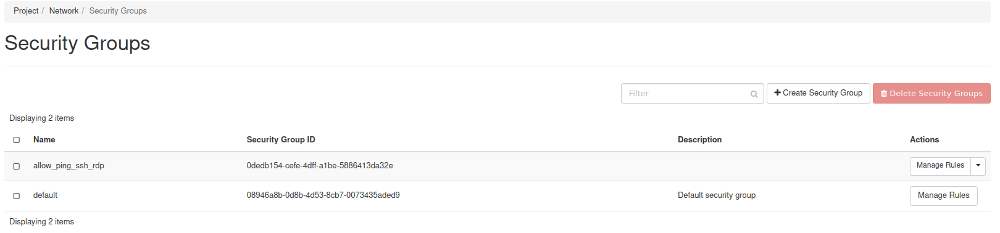
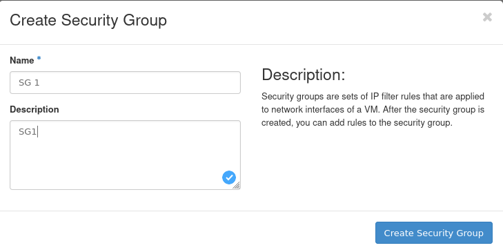
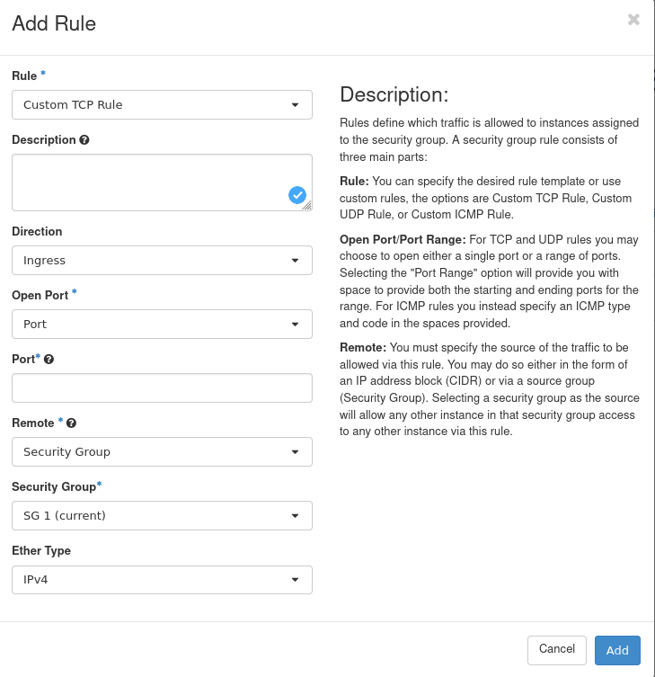
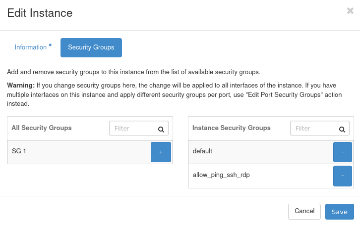
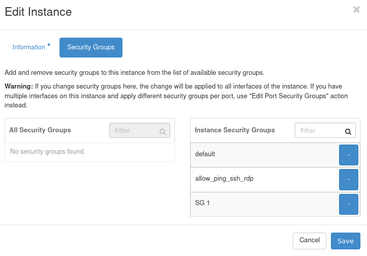

How to use Security Groups in Horizon?
======================================
Security groups in **OpenStack** allow you to filter and control the connection between the current virtual machine and different instances. They consist of set of rules which are responsible for **inbound** and **outbound** flow.

Each instance possesses default security group which deny incoming traffic and allow only outgoing traffic.

Let’s have the first more precisely look at it in the Horizon Panel:

1. Log in to your **creodias** account:

2. Look at the navigation panel, localised on your **left side**.

Go to **Network** and then choose **Security Groups** from dropdown menu:

3. Stay a while and analyse your current display. You may notice two separate security groups:

**Explanations:**
   - allow_ping_ssh_rdp contains set of rules for ingress directon for port 22(SSH) and port 389(RDP) This configuration is required for remote connection.
   
4.Let’s create a new security group for our basic tutorial to examine the process of adding new rules: Choose **“Create Security Group”** button.

The screen above should have appeared.

- Fill in the **“Name”** field with the name of your security group

- Fill in the **“Description”** field with the knowledge and data to recognize your security group(it is very helpful for end user)

After that, confirm the creation process with blue button in your lower-right-corner.

We are back to our previous position. Row with the “SG 1” should be visible. Currently our group does not differ much from default. Hence we are obligated to make new set of rules. Click on the **“Manage Rules”** button localizated at the right edge.

The new window with two **engress** rules should have appeared in front of you.

 

As we realised before, they are responsible for allowing whole outboud traffic.

Click on the **“add rule”** button to add the rule to the "SG 1" security group.

 

There we will be moved to the **form** with some blank spaces to fill in.

 

Each section describe the different option to individualise for our personal usage:

- **Rule:** Here we can choose from a lot of protocols, e.g SSH, SFTP or let it stay at the custom TCP or UDP setup. It can be translated as a desired template.
- **Direction:** It is simple, we can choose ingress or engress to precise our rule.
- **Open port:** It permits to clarify if we would like to apply particular rule for one port, few ports(range) or all ports.
- **Port:** Type in the number which identifies the port for protocol. E.g 80 for HTTPP
- **Remote:** Specify the source, which will be able to be applied in the traffic. You can choose either CIDR(IP Address Block) or do it via Source Group
- **CIDR:** Fill in if you earlier chose to filtr specific address by CIDR option
- **Either Type:** Decide to choose logical adressation type: 32 bit ipv4 or 128bit ipv6.

I created a HTTP ingress rule presented below:

Click **“Add”** Button to add the rule.

Mission accomplished. Therefore all we need to do is to apply created security group with the new Ingress rule to particular Virtual Machine.

5. Move on to our navigation panel on the left and change current workshop to Compute and then choose Instances.

I have created a “vm2” to perform a presentation of adding new security group to **instance**.

Let’s move to **Actions** column and click the down arrow to list available options.

We have to choose **“Edit Security groups”**.

Then, there should appear a panel **“Edit instance”** with two tables **“All Security Groups”** and **“Instance Security Groups”**. Click on the **“+”** sign to link "SG 1" to the Instance and finally click **"Save"**.

We have done it. Our security group with the new rule have been applied to the instance.

**Remember** that you can add security groups during process of the virtual machine initialization.
