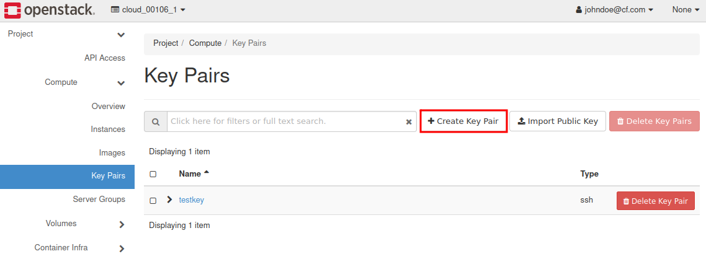
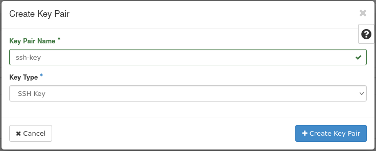
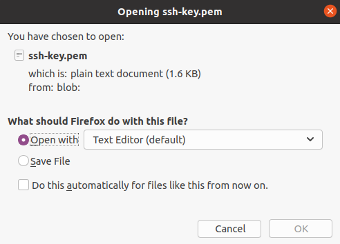
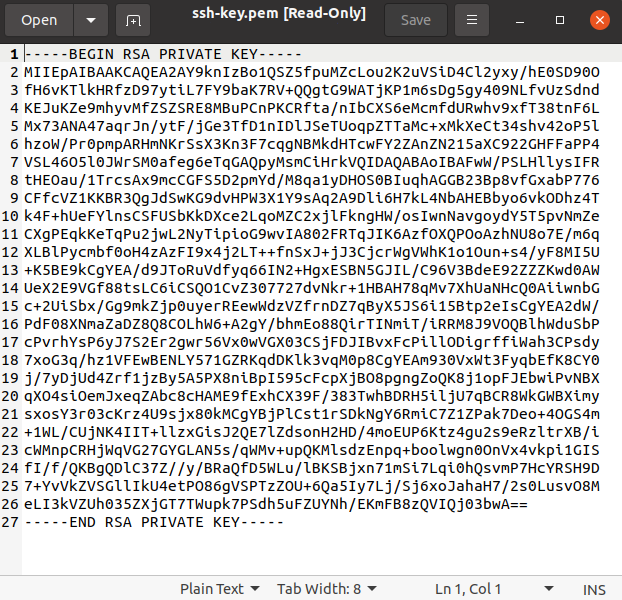
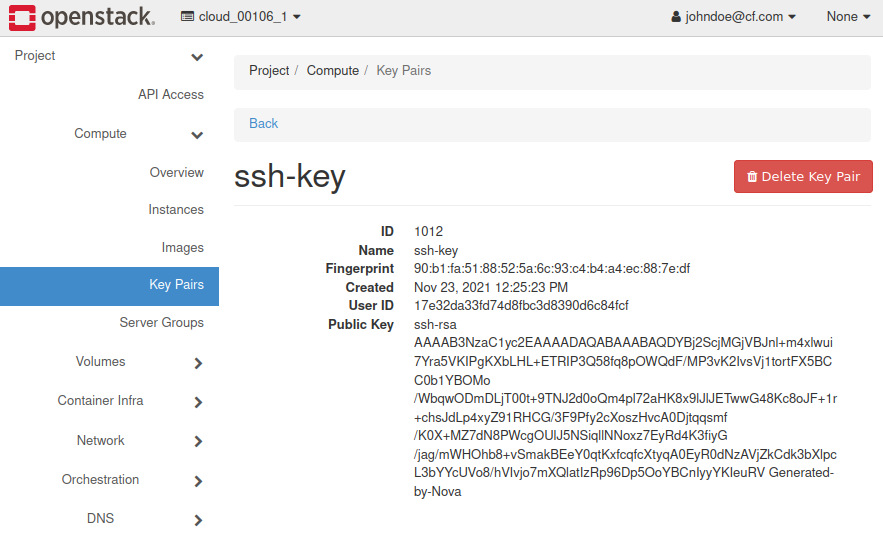

How to create key-pair in OpenStack dashboard?
================================================

Open **Compute -> Key Pairs** 

Click **Create Key Pair**, insert the name of the key (eg. "ssh-key") and Key Type.

After generating Key Pair your new Private Key download window will appear. Click **Open with Text Editor**

Save the key as **"id_rsa"**  in the folder of your choice (in linux the keys are usually kept in **~./ssh** folder).

In case of linux you should change the permissions on the private key:
 
::

   $ sudo chmod 600 id_rsa
   

 
Click key name in **Key Pairs** menu and read your **public key**. You can also save the key to a file like the private key. For example named **"id_rsa.pub"**.

* To connect via SSH to your Virtual Machine using Linux, follow the steps in this FAQ: `How to connect to your virtual machine via ssh in Linux? <https://cloudferro-cf3.readthedocs-hosted.com/en/latest/networking/connectviasshlinux/connectviasshlinux.html>`_
* To connect via SSH to your Virtual Machine using Windows (Command Prompt), follow the steps in this FAQ: `How to connect to a virtual machine via SSH from Windows 10 (Command Prompt) <https://cloudferro-cf3.readthedocs-hosted.com/en/latest/networking/connectviasshwin/connectviasshwin.html>`_
