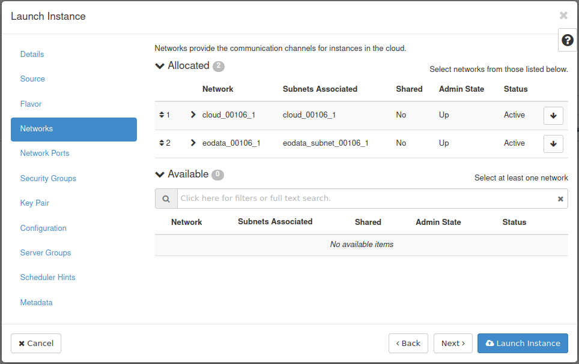

How to create new Linux VM in OpenStack dashboard (Horizon)?
============================================================

Go to **Project → Compute → Instances**.

Click **"Launch Instance"**.

Insert the name of the Instance (eg. "vm01") and click Next button.

Select Instance Boot Source (eg. "Image"), and choose desired image (eg. "Ubuntu 20.04 LTS") by clicking on arrow.

.. note::

   If you do not need to have the system disk bigger than the size defined in a chosen flavor, we recommend setting "Create New Volume" feature to "No" state.

Choose Flavor (eg. eo1.xsmall).

Click **"Networks"** and then choose desired networks.

Open **"Security Groups"** After that, choose "default" and "allow_ping_ssh_icmp_rdp" gropus.

Choose or generate SSH keypair `HOW TO CREATE KEY-PAIR IN OPENSTACK DASHBOARD? <https://cloudferro-cf3.readthedocs-hosted.com/en/latest/general/keypairopenstack/keypairopenstack.html>`_ for your VM. Next, launch your instance by clicking on blue button.

You will see **"Instances"** menu with your newly created VM.

Open the drop-down menu and choose **"Console"**.

 Click on the black terminal area (to activate access to the console). Type: **eoconsole** and hit Enter.
 
.. figure:: newvm10.png

Insert and retype new password.

Now you can type commands.

After you finish, type "exit".

This will close the session.

If you want to make your VM accessible from the Internet check `here <https://cloudferro-cf3.readthedocs-hosted.com/en/latest/networking/addremovefip/addremovefip.html>`_.
 
 
