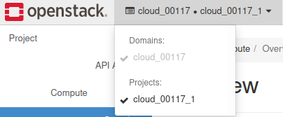
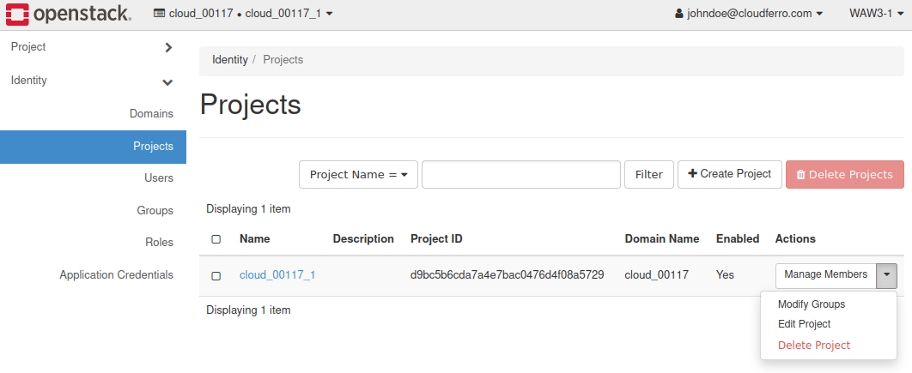

What is an OpenStack project?
=============================

A **project** is a isolated group of zero or more users who share common access with specific privileges to the software instance in OpenStack. A project is created for each set of instances and networks that are configured as a discrete entity for the project. In Compute, a project owns virtual machines (in Compute) or containers (in Object Storage).

You can imagine that the whole OpenStack cloud  is a big cake of resources (vCPU, disks, instances, etc…) and projects are the pieces of this cake served to the customers.

Current project name is **visible** in the Horizon panel.

Projects are created, managed, and edited at the OpenStack **Projects** screen.

Users can be associated with more than one project, but once signed, they can only see and access the resources available in that project.
Each project and user pairing can have a role associated with it.

OpenStack users can create projects, and create new accounts using the OpenStack Dashboard. They can also associate other users with roles, projects, or both.

To remove project its mandatory to manually remove all its resources first.

`Users can create private networks for connectivity within projects <https://cloudferro-cf3.readthedocs-hosted.com/en/latest/networking/createanetworkwithrouter/createanetworkwithrouter.html>`_. By default, they are fully isolated and are not shared with other projects.

