How to start a VM from a snapshot?
===================================

a) Volume Snapshot
------------------

1. Choose the desired virtual machine (booted from Volume) and click on the “Create snapshot” button.

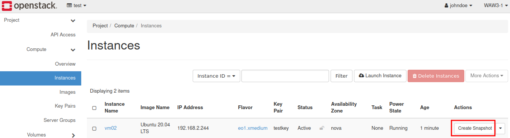

|

2. Name the snapshot. The decision is up to you to improve the personal navigation throughout image or volume snapshot repository. Confirm with the blue button.

|

3. Go to Volumes tab and press Snapshots.

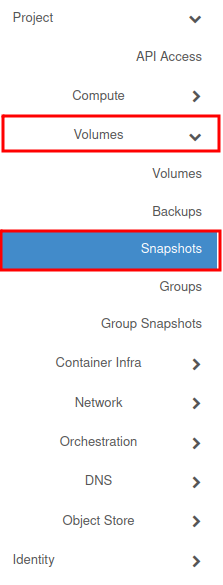

|
 
4. Your volume snapshot is being stored in this place. To start a virtual machine from this type of snapshot, press on the arrow beside “Create Volume”.

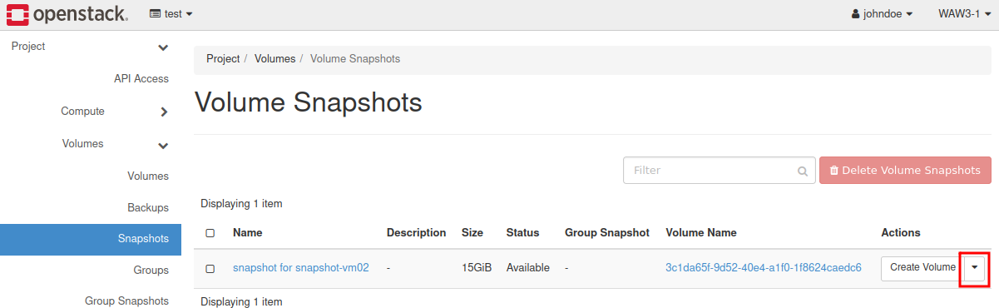

|
 
5. Choose “Launch as Instance”.

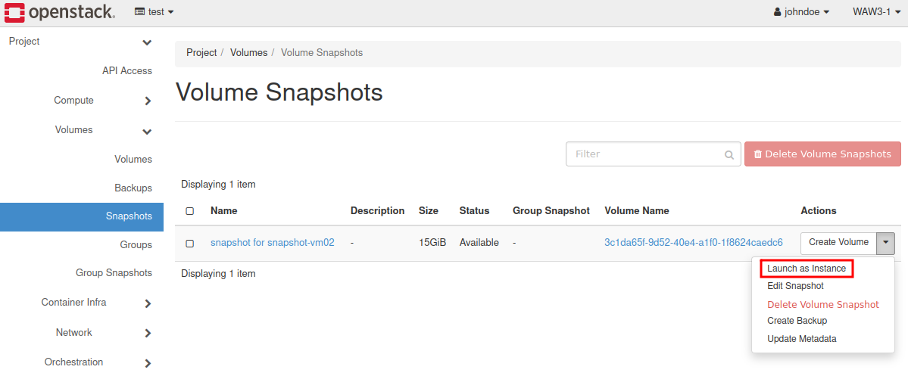

|
 
6. Define the Instance name and change the bookmark to “Source”.

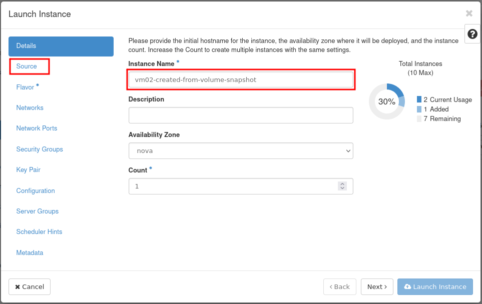

|

7. Set Boot Source on “Volume Snapshot” and assign previously created snapshot by clicking on the arrow.

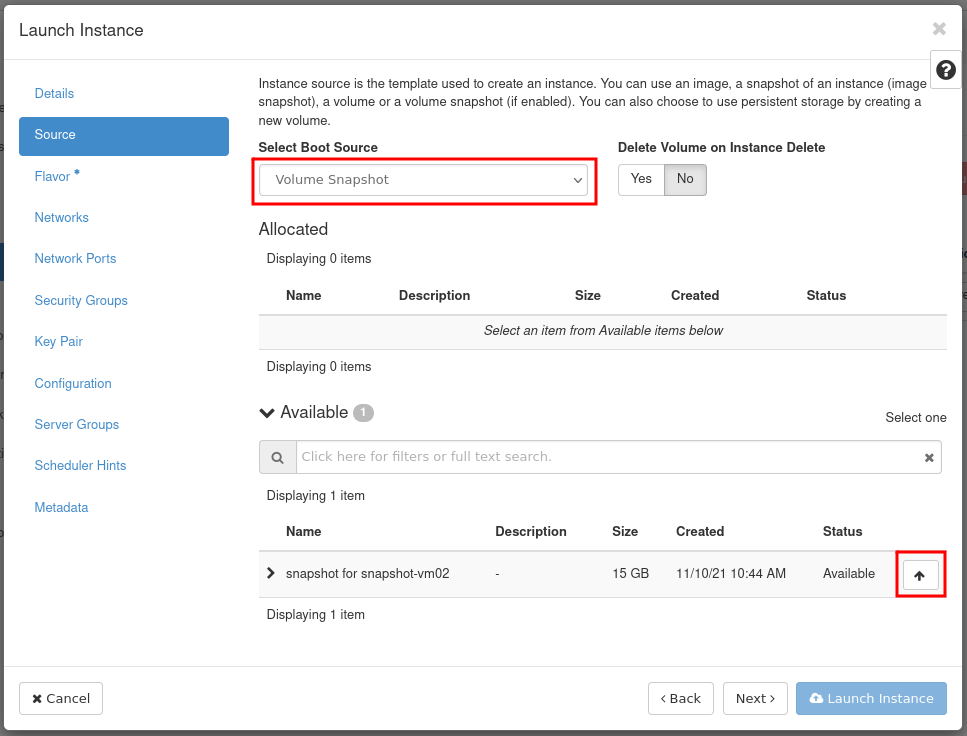

|

8. The rest of procedure is the same, hence there is an attachment: `How to create new VM in OpenStack dashboard (Horizon)? <https://cloudferro-cf3.readthedocs-hosted.com/en/latest/general/newlinuxvm/newlinuxvm.html>`_

|

9. Newly created machine is visible in the Instances list.

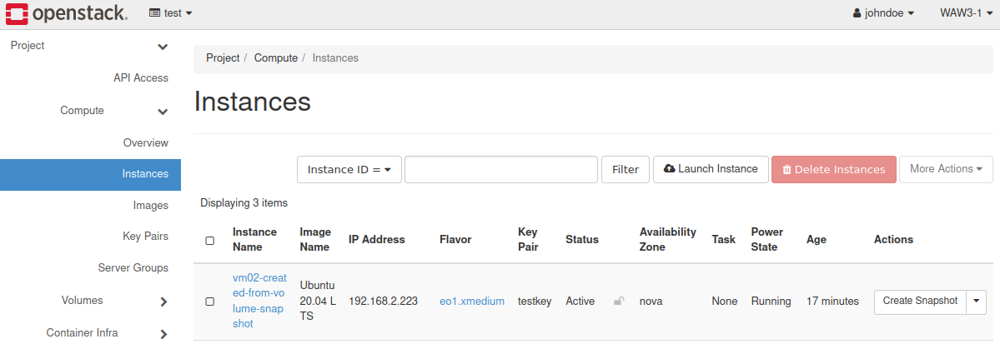

|

b) Image Snapshot
-----------------

1.Choose the desired virtual machine (booted from Glance image) and click on the “Create snapshot” button.

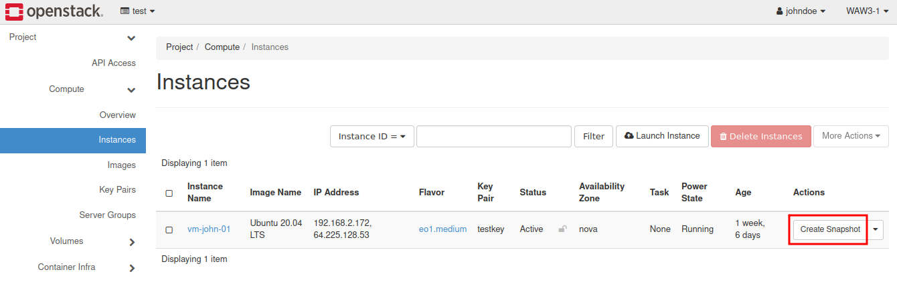

|

2. Name the snapshot. The decision is up to you to improve the personal navigation throughout image or volume snapshot repository. Confirm with the blue button.

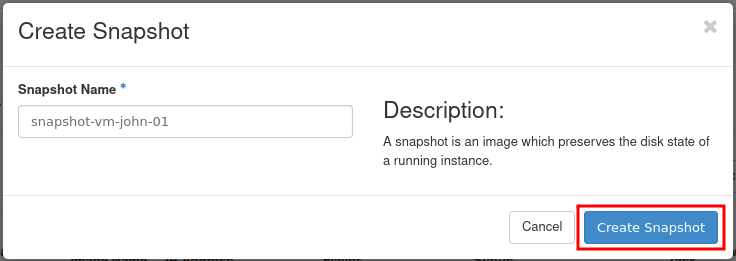

|

3. Go to Compute tab and press Images.

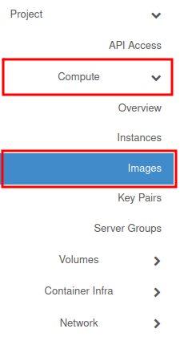

|

4. Scroll down and find your snapshot. Click on the “Launch”.

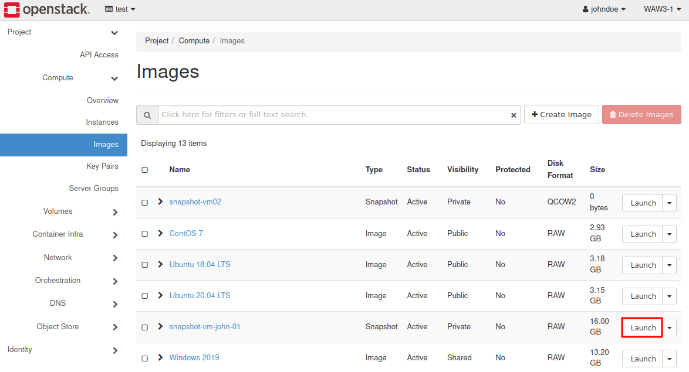

|

.. attention::

   Image snapshot is in RAW format and its size is equivalent to the image that VM was booted from.
   In the “Images” you may also find symbolic links to the volume snapshots.(i.e. snapshot-virtual-machine-01 from a) scenario). This type of snapshot is in format QCOW2 and its size is set on 0 bytes.

5. Name your virtual machine and go to “Source.” Set Boot Source on “Instance snapshot" and choose previously created Snapshot in RAW format.

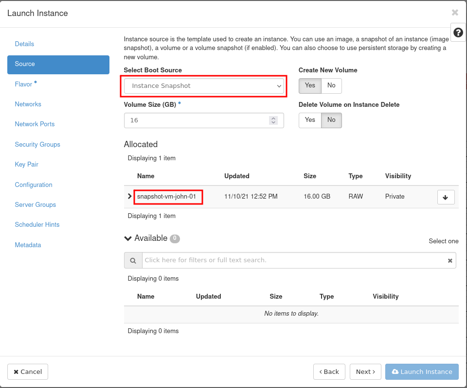

|

6.The rest of procedure is the same, please see here: `How to create new VM in OpenStack dashboard (Horizon)? <https://cloudferro-cf3.readthedocs-hosted.com/en/latest/general/newlinuxvm/newlinuxvm.html>`_

|

7. Virtual machine has been created.

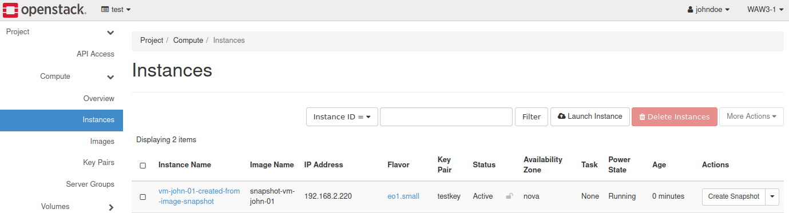

