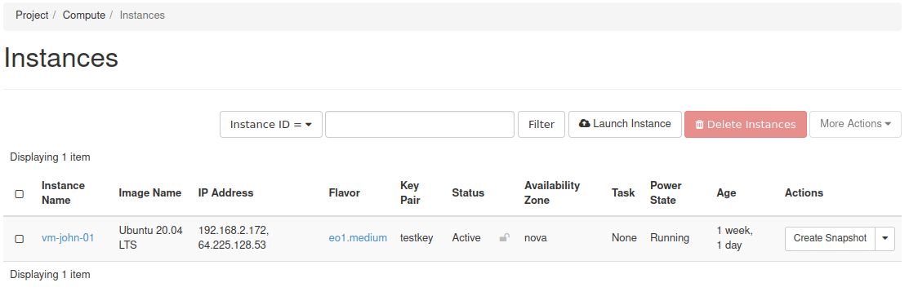

Status, Power State and dependences in billing of an instances (VMs)
====================================================================

Each Instance has its own Status and Power State (please keep in mind that terms are not synonymous). While Status informs us about present condition of the flavor, Power State tell us only whether VM are running or not.

|

We can distinguish six Power States, which we can divide to two groups, depending if VM is running or not.

| While running:
| NO STATE- VM is running, but encountered some fatal errors which require repeat launch of an instance,
| RUNNING- VM is running properly,
| PAUSED- VM is frozen and memory dump is made
|
| While turned off:
| SHUT DOWN- VM is powered off properly
| CRASHED- VM is turned down due to fatal error,
| SUSPENDED- VM is blocked by system (most likely because of negative credit on account)
|
| Concerning Status, we can discriminate following conditions (in brackets there are billable items mentioned for instances in per-use billing mode) :
|
| ERROR – instance is not working due to problems in creation process (user is not charged)
| ACTIVE – instance is running with the specified image (user is charged for particular chosen flavor and storage)
| PAUSED – instance is paused with the specified image (user is charged for flavor and storage)
| SUSPENDED – instance is suspended with the specified image, with a valid memory snapshot (user is charged for flavor and storage)
| SHUT OFF – instance is powered down by the user and the image is on disk (user is charged for chosen flavor and storage)
| SHELVED OFFLOADED – instance is removed from the compute host and it can be reverted by “Unshelve instance” button (user is charged for storage)
| RESIZED/MIGRATED- instance is stopped on the source node but running on the destination node. Images exist at two locations. User confirmation is required (user is charged for the new flavor and storage)
|
| Please note that floating IP addresses are billed regardless of instance state.
