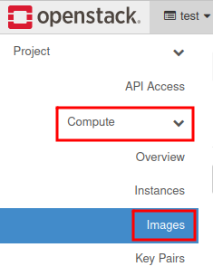
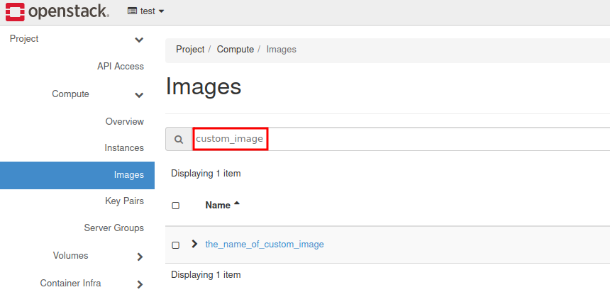
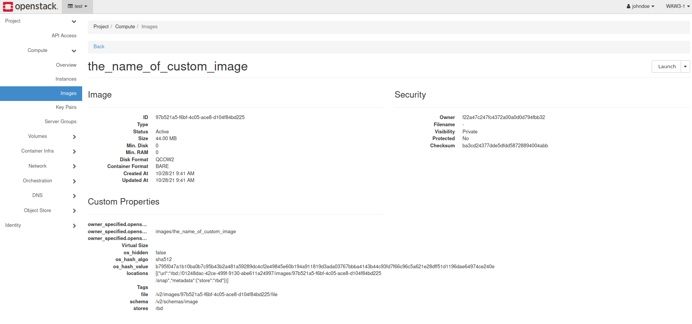

How to upload your custom image using OpenStack CLI?
====================================================

In order to add custom OS image to your cloud resources you may use python-openstackclient CLI.

Here are the installation instructions for Linux:

`How to install OpenStackClient (Linux)? <https://cloudferro-cf3.readthedocs-hosted.com/en/latest/openstackcli/openstacklinux/openstacklinux.html>`_

It is strongly recommended to use virtual environments to avoid installing wide-spread Python packages.

Here is how to use Python with Virtualenv configuration:

`How to install Python virtualenv/virtualenvwrapper? <https://cloudferro-cf3.readthedocs-hosted.com/en/latest/general/pythonvirtualenv/pythonvirtualenv.html>`_

There are also available tools for the same purpose such as: pipenv or miniconda.

 

1. If you have already prepared your working environment, you might open your terminal window.

|

2. Source the RC file that can be downloaded in Horizon dashboard.

::

   user@PC:~$ cd cloud_test/
   
   user@PC:~/cloud_test$ source test-openrc.sh 
   
   Please enter your OpenStack Password for project test as user johndoe: 
   
   user@PC:~/cloud_test$ 
   
|

3. Use openstack image create command to upload an image to Glance repository.

.. warning::

   custom_image.qcow2 is your custom image that you have obtained on your own.
   
::
 
    user@PC:~/cloud_test$ openstack image create --disk-format qcow2 --container-format bare \

    --private --file ./custom_image.qcow2 the_name_of_custom_image
   

**Additional parameters for often usage:**

--disk-format <disk-format>

--min-disk <disk-gb>

--min-ram <ram-mb>
   

For more explanations, you may easily use:

::

   openstack image create --help
   

After completion, you should gather necessary information from the console output. (table with data)

 

4. In order to check our new image in Horizon dashboard, please log in to `horizon.cloudferro.com <https://horizon.cloudferro.com/>`_

|

5. Go to Compute → Images

|

6. Type in filter: custom_image

|

7. You may click on the image to inspect advanced data.

