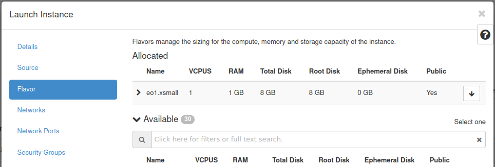

VM created with option "Create New Volume" - No
================================================

If you choose "Image", you can choose the option "Create New Volume": Yes or No

By default the option "No" is chosen

|

the new Virtual Machine will be created with System Volume (Root Disk) defined in the flavor.

|

If you want to choose different size of the System Volume (Root Disk) - check the article `VM creation - option Create New Volume - Yes <https://cloudferro-cf3.readthedocs-hosted.com/en/latest/general/vmnewvolumeyes/vmnewvolumeyes.html>`_.

|

In contrast to VM created with option `Create New Volume - Yes <https://cloudferro-cf3.readthedocs-hosted.com/en/latest/general/vmnewvolumeyes/vmnewvolumeyes.html>`_ , the system disk is "ephemeral" - it is not visible in Volumes pane.

