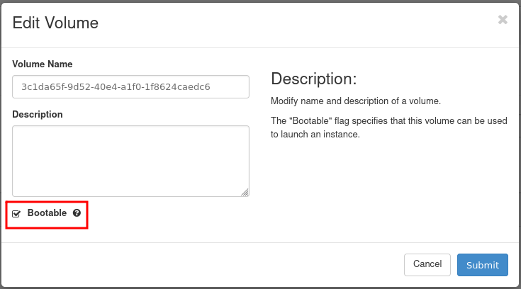

VM created with option "Create New Volume" - Yes
================================================

.. note::

   While creating a new Virtual Machine, you have to choose the source from which the VM will be built.
   

|

If you choose "Image", you can choose the option "Create New Volume": Yes or No

By default the option "No" is chosen

**Option: Create New Volume - Yes**

This option allows you to choose the system volume different from that defined in the flavor

|

Now you can choose the Volume Size

In the example below we will choose the volume 15 GB and apply it to the flavor eo1.xsmall

Default size of the system disk for flavor eo1.xsmall is 8 GB

|

After choosing the other parameters (Details, Flavor, Networks, Security Group and Key Pair) you can launch the instance

|

You can see the VM created

|

If you go to Volumes -> Volumes pane you can see the system volume which the new VM is built on

|

If you click on "Edit Volume" button, you will see that the volume is bootable

|

If you previously have chosen "Delete Volume on Instance Delete": No

|

and now you will delete the VM:

|

then the volume will remain (not attached to any instance)

|

You can now create a new VM from the volume choosing "Launch as Instance"

|

you can choose different new flavor (eg. eo1.xmedium) than original  (eo1.xsmall)

|

After choosing other parameters (Details, Networks, Security Group and Key Pair) you can launch the instance.

