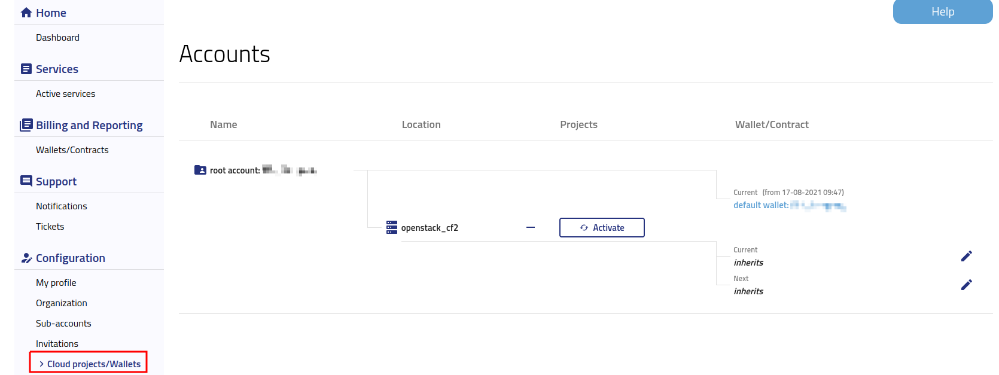

Accounts and Projects management
=================================

After logging into https://new.cloudferro.com/ press **Cloud projects/Wallets** button on the left bar menu to see details of your projects.

In the tab you can check:

 * Account name assigned to your Organization,

 * Cloud location, 

 * Projects (OpenStack projects assigned to your account),

 * Wallet/Contract (billing mode; for more details please visit `Wallets and Contracts management <https://cloudferro-doc.readthedocs-hosted.com/en/latest/gettingstarted/Contracts-Wallets.html>`_)

**Please note that account is automatically assigned to the default Wallet.** 

You can change wallet by clicking on **inherits** button, however: 

 * The change will be applied immediately and will affect how you are billed for services.

 * The dates of the current and next wallet cannot overlap.

 * If you leave a gap between the current and the next wallet account will inherit wallet from the parent account during this time. 

To activate new project please press **Activate** button.
