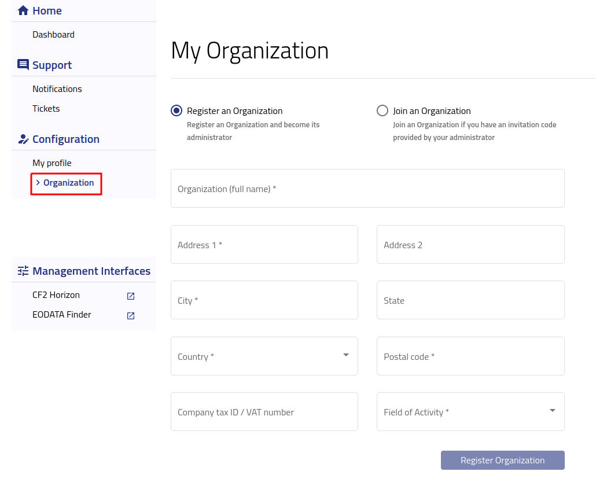

Adding and editing Organization
==========================================

After logging into https://new.cloudferro.com/ press **Organization** button on the left bar menu.

   

In **My Organization** tab you can register an organization and become its administrator or join an organization if you have invitation code provided by it's administrator.
To register new organization please fill up all fields marked with ***** and press **Register Organization** button. 
Once you register your organization you will be able to view and edit details.

TAX ID / VAT field is not required but without providing the data you wont be able to complete automatic order or start new contract. VAT field is required if you need to receive invoice with correct tax rate.  

 
After registration please go back to the left bar menu and select **Organization**.

In **My Organization** tab you will be able to:

 * check organization registration date

 * view and edit organization name, address and TAX ID / VAT number

 * manage assignments
