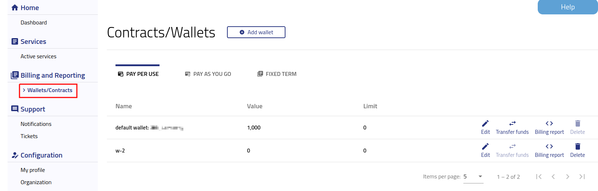

Wallets and Contracts management
==========================================

After logging into https://new.cloudferro.com/ press **Wallets/Contracts** button on the left bar menu.

   

There are 3 types of billing mode:

**PPUSE (Pay Per Use Wallet)**

Prepaid billing mode where services are billed according to usage. Tenant purchase a credit in a form of Billing Units (BU) with are added to his system wallet and are used to provision and keep resources and services. Billing Units (BU) are evaluated to 1 Euro for the sake of Price List. Billing Units (BU) are purchased through e-commerce or written contracts. Every 2 h tenant credit is decreased with the cost of used resources billed with an accuracy of up to 2 seconds. This is a very flexible mode that allows to create and remove resources at will and pay only for the used resources. This is a mode useful for experimental and development work or for environments with very variable resources.

To add additional wallet please click **Add wallet** button on the top. 
To add funds to your already created wallet you need to use **Transfer funds** option.
Please note that wallet can be deleted once all funds are transferred to another wallet.
You can check your billing by clicking **Billing record** button.

**PAYG (Pay As You Go Contract)**

Postpaid billing mode where Tenants are invoiced periodically based on actual usage. In this mode, a Tenant sign a written contract and is billed usually on monthly bases for actual usage of services and resources. PAYG contracts are purchased only through our sales department in a form of written contracts. With the exception of FIXED-TERM orders all services and resources ordered under Accounts/Projects that are attached to the PAYG contract will be added to the invoice issued at the end of agreed period. Billing is done every 2 hours. Tenants sees the increase in usage with the cost of used resources billed with an accuracy of up to 2 seconds.

To add PAYG wallet you need to raise a ticket first (please check `Helpdesk and Support <https://www.cf-docs.cf/en/latest/gettingstarted/Help-Desk-And-Support.html>`_).

**FIXED-TERM (Fixed Term Contract)**

Billing mode where services are bought for longer periods. In this mode, Tenant purchases defined services for defined periods. FIXED-TERM contracts are purchased through e-commerce or written agreements. The long-term resources are paid directly according to price and currency stated. One cannot then change these resources but on the other hand obtains much cheaper offering. This mode is preferable for long-term usage of well-defined environments with well understood needs.

In order to successfully apply FIXED-TERM billing mode to given service in particular billing session, the contract is required to fulfill the following conditions:

    * Be active at the beginning of the session or at the moment when resource is launched;

    * Be active till the end of the 2 hours billing session.

If any of the conditions listed above is not met, service is to be billed in PPU/PAYG mode.

As a result of described billing system behavior, if contract is activated after launching services, FIXED-TERM billing mode is to be applied to them at the beginning of next billing session and not immediately.

To check **how to add wallet to specific project** please visit `Accounts and Projects Management <https://cloudferro-doc.readthedocs-hosted.com/en/latest/gettingstarted/Accounts-Projects.html>`_.
