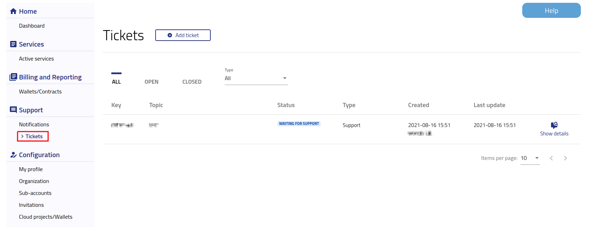
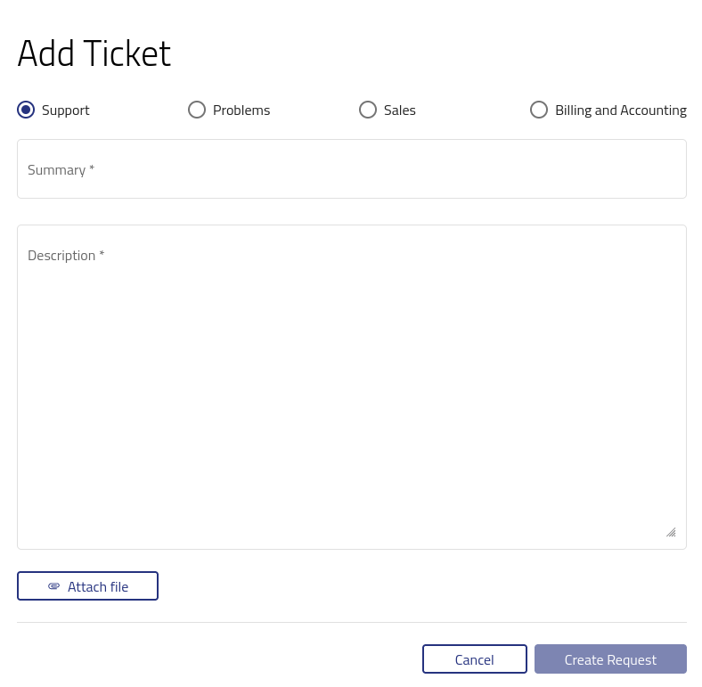

Helpdesk and Support
=====================

After logging into https://new.cloudferro.com/ press **Tickets** button on the left bar menu to create or manage your tickets.

   
There are few tabs available in Tickets menu:

 * **ALL** - allows you to view all your tickets
 * **OPEN** - shows your open tickets
 * **CLOSED** - contains list of closed tickets

As it is show on the above picture, all tickets are categorized by Key, Topic, Status, Type, Created date and Last update date.
You can sort your tickets by **Type**. For this purpose choose **Support**, **Problems**, **Sales**, **Billing and Accounting**, from the top drop down list.
To check details or add comment to existing tickets, please use **Show details** option on the right side of the window.

If you want to create a new ticket, press **Add ticket** button on the top of the side.

Choose proper category, add **Summary**, describe the issue and press **Create request** button.
Once you press the button ticket will be visible in the **OPEN** tab.

 
 
