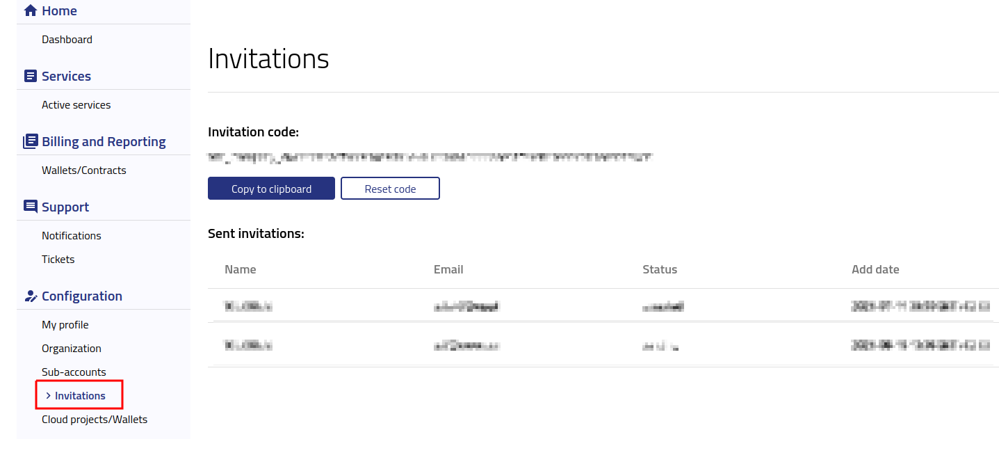
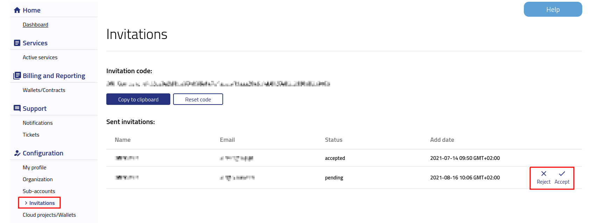

Inviting new user to your Organization
==========================================

To invite a new user to your organization you need to share an **invitation code**.

After logging into https://new.cloudferro.com/ press **Invitations** button on the left bar menu.

 

Now you can copy an invitation code by clicking on **Copy to clipboard** button and send it to a new user by email.

User after receiving the code will join the organization by clicking **Join an Organization** in **Organization** tab and pasting the invitation code.

As a organization admin you need to accept the invitation first.
Go to the **Invitations** tab and choose an invitation that you want to accept or in other case reject.

   

After accepting the invitation you will be able to add/edit roles. For more details please check `Users and roles <https://cloudferro-doc.readthedocs-hosted.com/en/latest/gettingstarted/Users-Roles.html>`_. 
   
