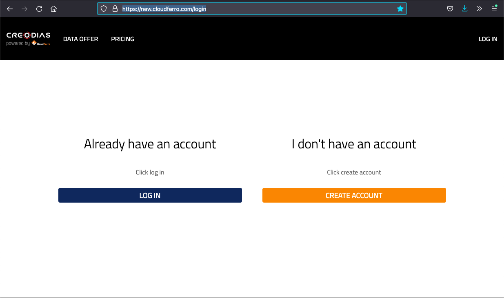
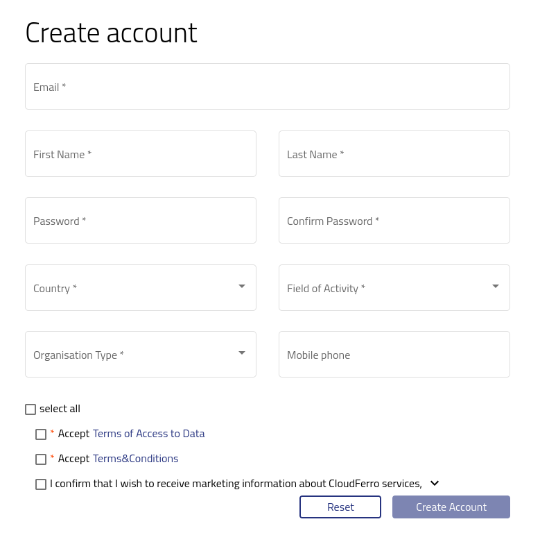

Registration and Setting up an Account
==========================================

Go to the https://new.cloudferro.com/ site and press **CREATE ACCOUNT** button.

   

Fill up all fields marked with ***** including accepting mandatory terms and conditions and press **Create Account** button.

Please note that marketing consents are not mandatory and can be changed at any time.
   

   

Once you create account below screen will appear. Please check your mail box and verify mail. After that you will be able to log in.
   

**After creating personal account you can either create new company account or join existing an existing account.**

**If you are a single user you can only access limited number of services.**
