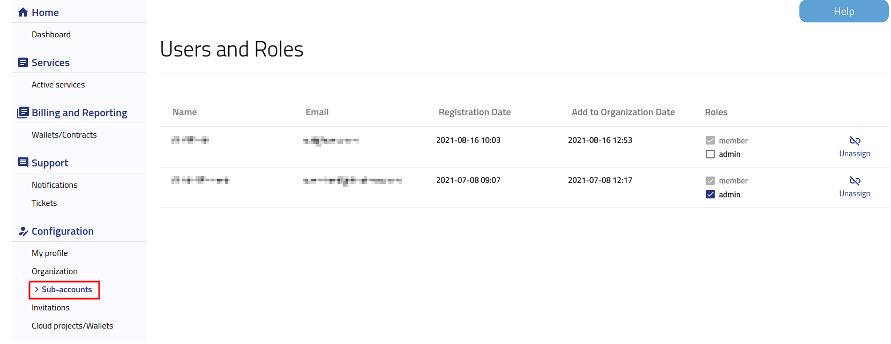

Removing user from Organization
==========================================

After logging into https://wekeoelasticity.cloudferro.com/ press **Sub-accounts** button on the left bar menu to check list of members of your Organization.

|
| Select user that you want to be removed and press **Unassign** button on the right side and after that press **Confirm** button.
| User will received notification about removing from your Organization.
