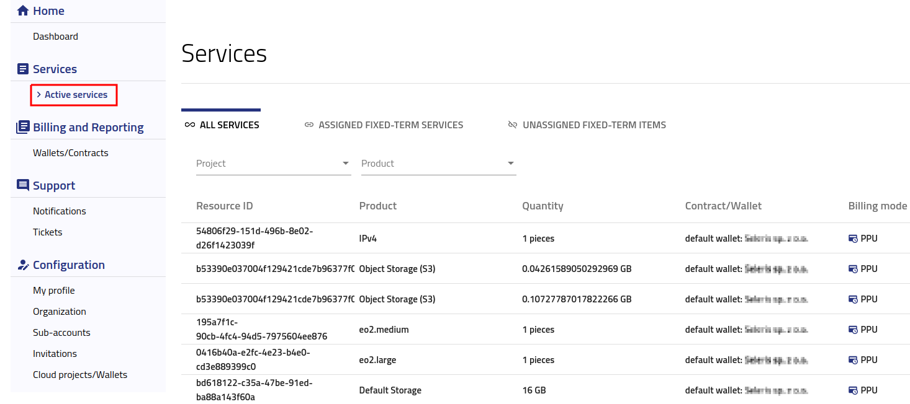

Services
========

After logging into https://new.cloudferro.com/ press **Active services** button on the left bar menu.

   

In this tab you are able to filter your services by Project or by Product.

You can also check what type of contract or billing mode is assigned to your services. For more details please visit `Accounts and Projects management <https://cloudferro-doc.readthedocs-hosted.com/en/latest/gettingstarted/Accounts-Projects.html>`_.

How to change assigned contract
*******************************

PAY PER USE - user can assign wallet to specific project in the **Accounts** tab

PAY AS YOU GO - user can assign wallet to specific project in the **Accounts** tab

FIXED TERM - is assigned by CloudFerro Support Team during the contract creation

Please note that PPU/PAYG assignment status is visible in the **Accounts** tab.
