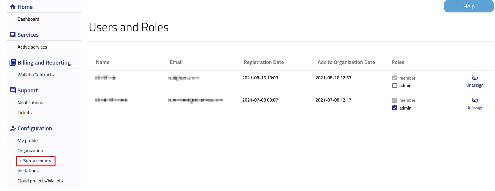

Users and roles
==========================================

After logging into https://new.cloudferro.com/ press **Sub-accounts** button on the left bar menu.

Now you are able to:

 * Check the list of users from your organization and their roles

 * Unnassign users from the organization (admin role)

If you want to check **Invitations** please visit `Inviting new user to your Organization <https://cloudferro-doc.readthedocs-hosted.com/en/latest/gettingstarted/Inviting-New-User>`_.
