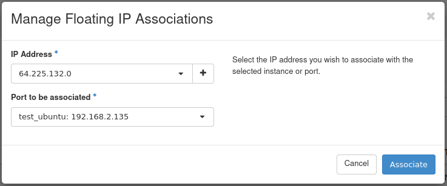

How to Add/Remove Floating IP’s to your VM?
===========================================

In order to make your VM accessible from the Internet, you need to use Floating IP’s. Floating IP’s in Openstack are public IP addresses assigned to your Virtual Machine. Floating IP assignment allows you (when you have Security Groups set properly) to host services like SSH, HTTP or other over the Internet.

**How to assign a Floating IP to your VM:**

In Instances tab in Horizon, click the dropdown menu next to your VM and choose „Associate Floating IP”

You will be shown a window like this one:

You may choose an address from the dropdown menu, but if it's empty, you need to allocate an address first. Click "+" icon on the right.

Click "Allocate IP". 

  
Select newly allocated IP address and click Associate.

.. note::
   
   The IP address should be associated with a local address from "192.168.x.x" subnet. If you have "10.x.x.x" address change it to "192.168.x.x" address.
   
   
Click "Associate".
 
.. note::

   The VM's communicate between themselves trough internal network "192.168.x.x" so if you are connecting from one Virtual Machine to another 
   you should use private addresses. If you try to connect your VM to the wrong network you will be notified by the following the message.
   
 

You now have public IP assigned to your instance and visible in Instances menu:

You can now connect to your Virtual Machine trough SSH or RDP from the Internet.

**How to disassociate Floating IP:**

If you no longer need public IP address you may disassociate it from your VM. Click "Dissasociate Floating IP" from the dropdown menu

**How to release Floating IP (return it to the pool)**

Floating IP’s as any other Openstack resources have their cost when kept reserved and not used.

If you don't want to keep your Floating IP’s reserved for your project you may release them to the Openstack pool for other users which will also reduce your project costs.

Go to Project → Network → Floating IPs

For the address that is not in use, the "Release Floating IP" option will be available. Click it to release the IP address.

