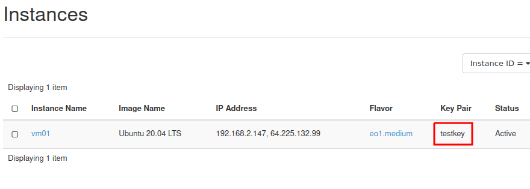
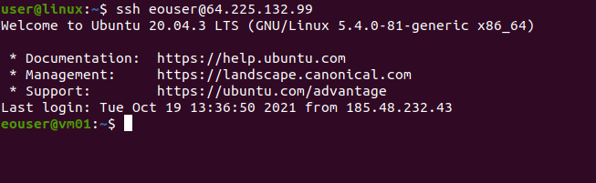

How to connect to your virtual machine via SSH in Linux?
========================================================

**1. Prequisities:**

1.1. The private and public keys were created. The key files were saved on the local disk of the computer. It is recommended to put the keys in the **~/.ssh** folder.

1.2. During the virtual machine creation procedure, the generated key we want to use was indicated. 

For example, when you create an SSH key named **"testkey"** in the Horizon dashboard, its name will appear next to your VM.

   
**2. Connecting to a virtual machine via SSH:**

2.1. If your virtual machine has already been assigned a Floating IP (the instances menu next to your virtual machine lists the IP address) you can proceed to the next step. If not, please follow `How to Add/Remove Floating IP’s to your VM? <https://cloudferro-cf3.readthedocs-hosted.com/en/latest/networking/addremovefip/addremovefip.html>`_

2.2. Go to the **~/.ssh** folder where your SSH keys were placed. Start terminal (right click and click "open in terminal").

2.3. Change the permissions of the private key file. In the case of file named **id_rsa**, type:

.. code::

   sudo chmod 600 id_rsa

Enter your password and confirm.
 
2.4. Once you have completed all of the above steps, you can log in. Let us assume that your generated and configured floating IP address is in this case **64.225.132.99**. Type in the terminal console and confirm:

.. code::

   ssh eouser@64.225.132.99

2.5. The username in the terminal will change to **eouser**. This means that the SSH connection was successful.

 
 
