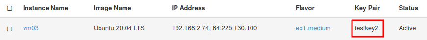
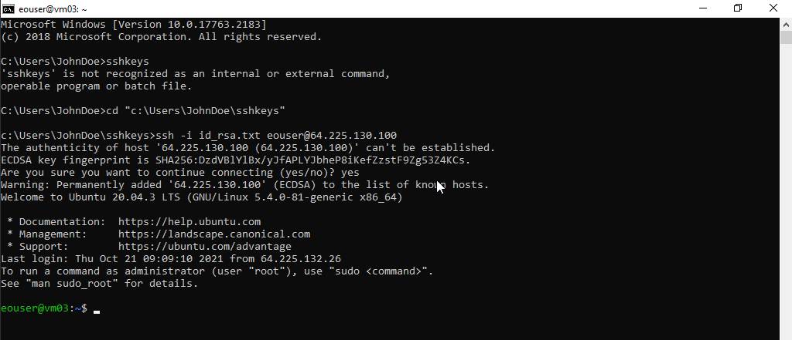

How to connect to a virtual machine via SSH from Windows 10 (Command Prompt)
============================================================================

**1. Prequisities:**

1.1. The private and public keys were created. The key files were saved on the local disk of the computer.

1.2. During the virtual machine creation procedure, the generated key we want to use was indicated. 
For example, when you create an SSH key named **"testkey2"** in the Horizon dashboard, its name will appear next to your VM.

**2. Connecting to a virtual machine via SSH:**

2.1. If your virtual machine has already been assigned a Floating IP (the instances menu next to your virtual machine lists the IP address) you can proceed to the next step. If not, please follow `How to Add/Remove Floating IP’s to your VM? <https://cloudferro-cf3.readthedocs-hosted.com/en/latest/networking/addremovefip/addremovefip.html>`_

2.2. Click START button and type **"Manage optional features"**

2.3. Check in **"Installed features"** if **OpenSSH client** is installed, if not click **Add a feature** search for **OpenSSH client** and install it.

2.4. Run the **Command prompt (CMD)** and change the folder to the folder where you store the SSH keys.
For example:

.. code::

   cd c:\Users\JohnDoe\sshkeys

2.5. In case of name of your ssh key is **id_rsa.txt** and the floating IP is **64.225.130.100** type:

.. code::

   ssh -i id_rsa.txt eouser@64.225.130.100
 
2.6. If the username has changed to **eouser@vm03**, the connection has been successfully established.

