How to create a network with router in Horizon Dashboard?
==========================================================

When you create a new project in Horizon, its content is empty. You have to manually configure your private network. In order to complete this task, please follow those steps.

 

1. Log in to your OpenStack dashboard and choose **Network** tab, then choose **Networks** sub-label.

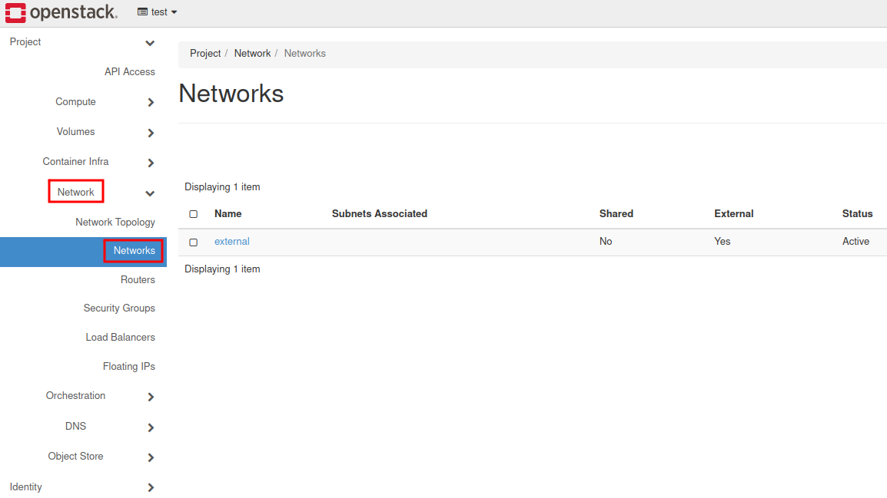

2. Click on the **“Create Network”** button.

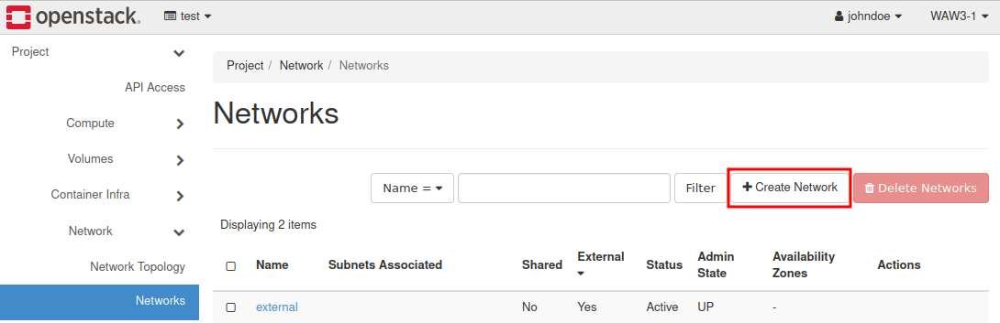

3. Define your Network Name and tick two checkboxes: **Enable Admin State** and **Create Subnet**. Go to Next.

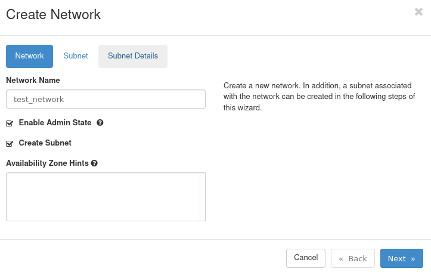

4. Define your Subnet name. Assign a valid network address with mask presented as a prefix. (This number determines how many bytes are being destined for network address)

Define Gateway IP for your Router. Normally it’s the first available address in the subnet.

Go to Next.

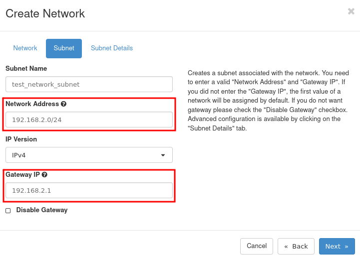

5. In Subnet Details you are able to turn on DHCP server, assign DNS servers to your network and set up basic routing. In the end, confirm the process with **“Create”** button.

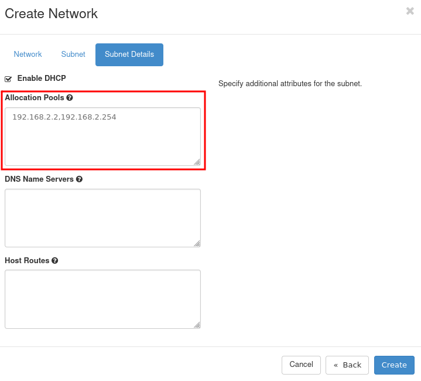

6. Click on the **Routers** tab.

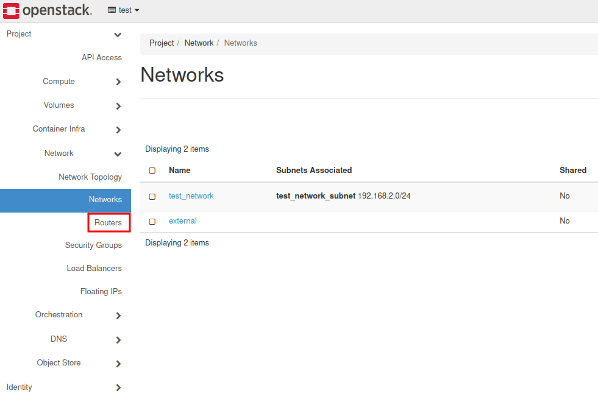

7. Click on the **“Create Router”** button.

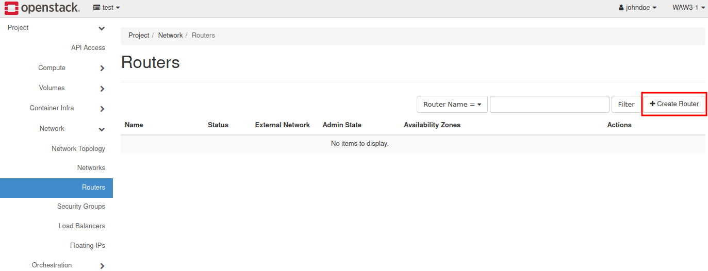

8. Name your device and assign the only available network → external. Finish by choosing **“Create Router”** blue button.

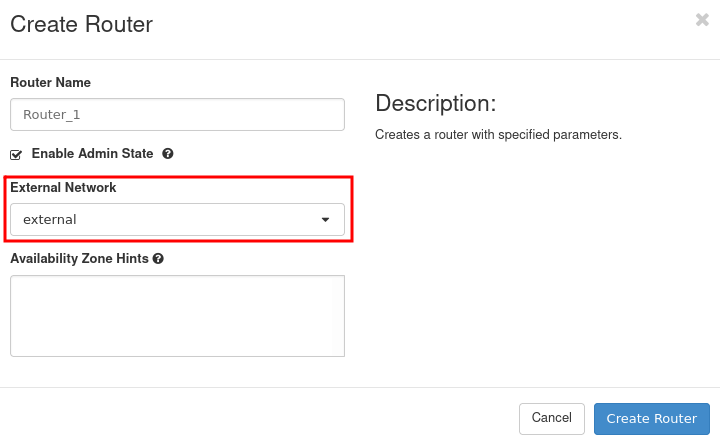

9. Click on your newly created Router (e.g called “Router_1”).

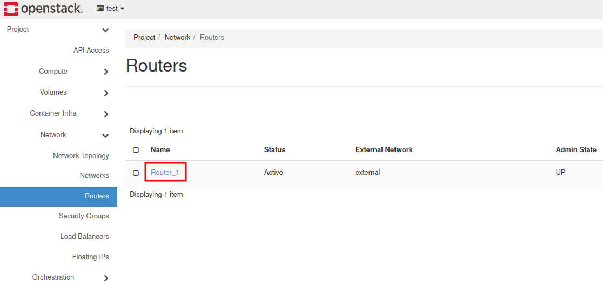

10. Choose **Interfaces**.

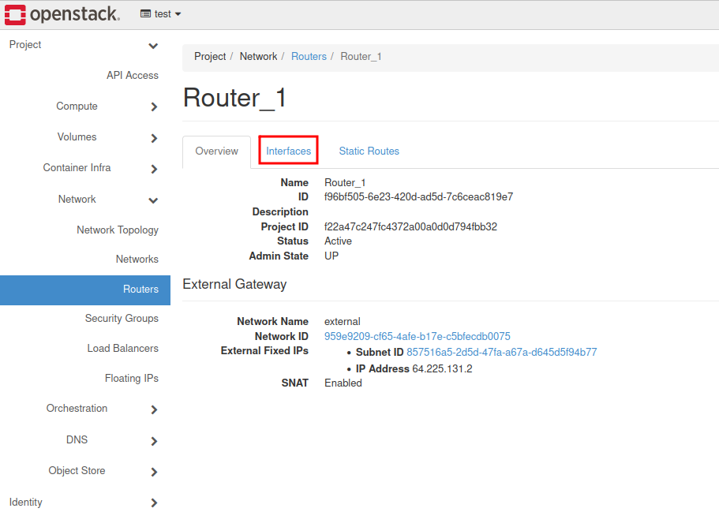

11. Choose **+ Add Interface** button.

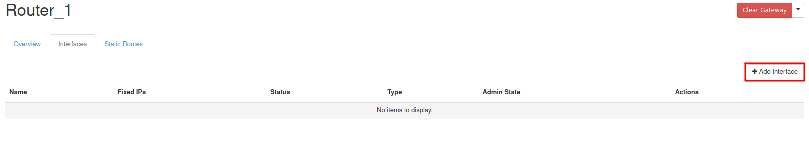

12. Assign a proper subnet and fill in IP Address. (It’s the gateway for our network). Submit the process.

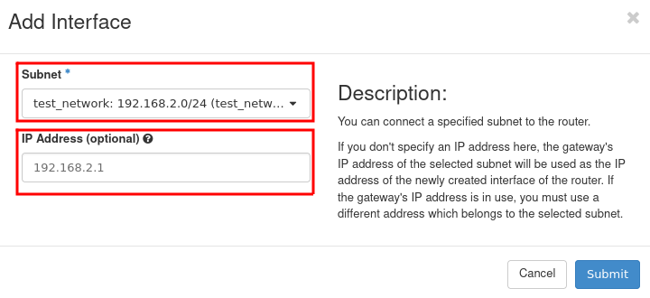

13. The internal interface has been attached to the router.

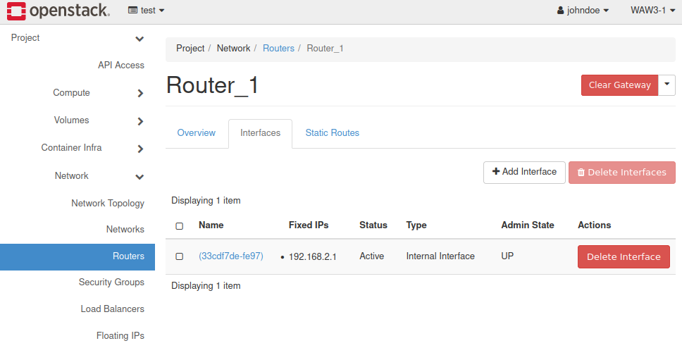

