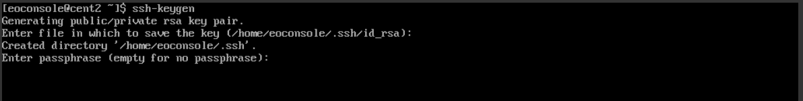
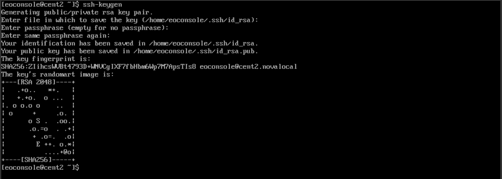

Generating a SSH keypair in Linux
=================================

In order to generate SSH keypair in Linux, we recommend using a command "ssh-keygen".
If system does not see this packet installed, please install the latest updates using command:

::

   sudo apt-get update && apt-get install openssh-client
   
(for Ubuntu and Debian family),
or

::
   
   sudo yum install openssh-clients
   
(for CentOS and Red Hat).

After that, in terminal (in systems with graphic user interface terminal can be acquired by pressing Ctrl + Alt + T) please enter command:

::

   ssh-keygen
   

(with additional flags:)

  -t rsa \  authentication key type
  -b 4096 \ bit length (greater the value, more complicated key will be, available values: 1024, 2048, 4096; 2048 if not specified )
  -C "user@server" \ name for identification at the end of the file
  -f ~/.ssh/keys/keylocation \ location of folder with ssh keys
  -N passphrase \ passphrase, can be ommited if user prefers connecting without additional key security

Application will ask for name of the key (press Enter for defaults - id_rsa for private and id_rsa.pub for public key) and passphrase (press Enter to ignore).

Next, ssh-keygen will show location, where the keys are saved, fingerprint of keypair and certain semigraphic image as expression of randomness in generating unique key.
 

To avoid problem with rejecting files due to too open permissions, simply navigate to the folder containing both keys and enter command:

::

   chmod 600 id_rsa && chmod 600 id_rsa.pub
   
 
