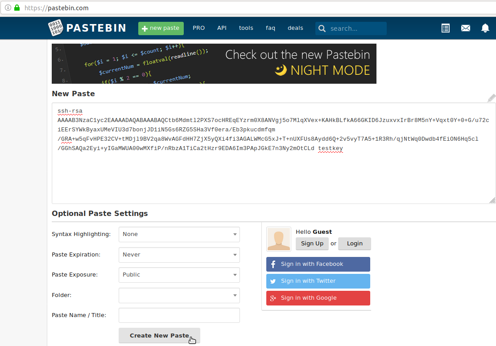
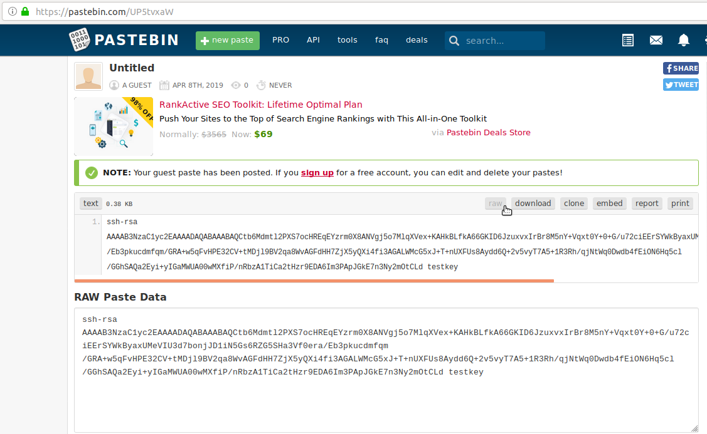
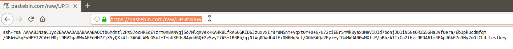
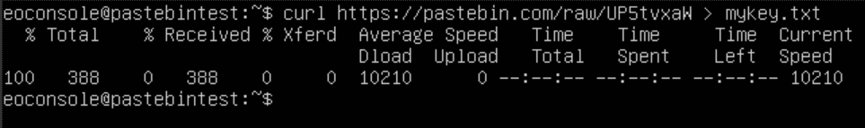
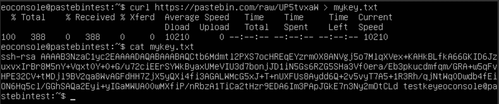

How to add SSH key from Horizon web-console?
============================================

While using web console on your VM, you may face situation when you will have to enter SSH public key.

Unfortunately, copy/paste functionality in not supported by our console. For adding a key to an existing instance, the easiest method would be getting the key via curl.

For instance you may go to https://pastebin.com/ and put your public key there (you can set if and how long content is visible to others and so on)

copy URL of raw pastebin content (for obtaining a raw content, click on "Raw" icon),

   
   

   
and issue the command from inside of instance:
   
::

   curl <pastebin url here> > mykey.txt

   
After downloading the file, you may check if your key is saved correctly using cat command:

::

   cat mykey.txt

Please note that the key must be put into /home/eouser/.ssh/authorized_keys, because you can ssh to your instance as eouser, but not as eoconsole. So once you are eoconsole user and get the key as described above, you should use:

::

   cat mykey.txt | sudo tee /home/eouser/.ssh/authorized_keys

   
   
