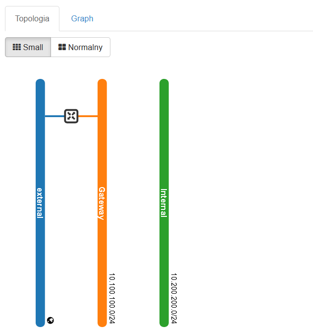
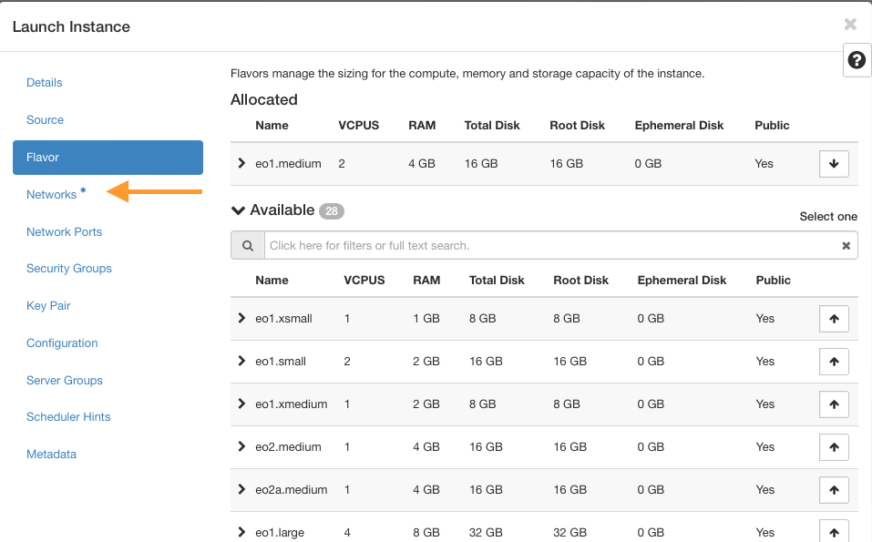
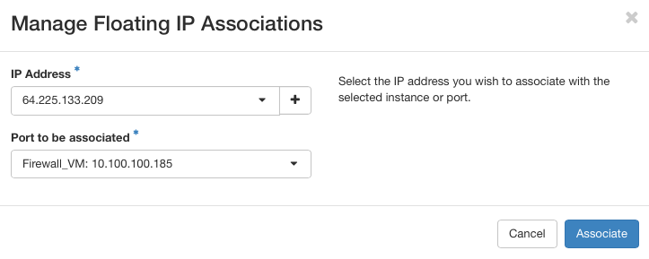

How to run and configure Firewall as a service and VPN as a service?
====================================================================
**This guide provides a sample process for configuring VPN as a service. It should not be considered the only way to configure this solution.**

To start the VPN as a service, it is necessary to configure and start the Firewall as a service. 
The sequence of steps will be described below.

**Creating FWAAS infrastruture** 

**Creating and configuring local networks**

1. Log in to your OpenStack dashboard and choose **Network** tab, then choose **Networks** sub-label.

2. Click on the **“Create Network”** button.

3. Define your Network Name as "Gateway" and go to Subnet Tab.

4. Define your Subnet name as "Gateway_subnet". Network address: **10.100.100.0/24** and gateway IP **10.100.100.1**.

5. In Subnet Details keep **Enable DHCP** marked. Rest of fields leave blank and click **Create** button.

6. Repeat this procedure from points 2-5 using different data: 

* Network Name: **"Internal"**
* Subnet Name: **"Internal_subnet"**
* Network Address: **10.200.200.0/24**
* Gateway IP: **10.200.200.1**

7. Click on the **Create Router** button.

8. Name your device as for example **"Router_Fwaas"**. Choose **external** network in **External Network** tab. Click **Create Router**.

9. Click on your newly created Router (e.g called “Router_Fwaas”).

10. Choose **Interfaces** and **Add Interface** button.

11. Choose from **Subnet** menu the **Gateway** subnet and click **Submit** button.

   

12. Choosing **Network -> Network Topology** the network topology should looks like this.

   

**Creating and configuring the VM with installed Firewall client**

13. Open **Compute -> Instances** tab and choose **Launch instance**.

   

14. Name the VM instance (for example **Firewall_VM**) and go to **Source** tab.

   

15. Find **opnsense** image and add it to your VM. Go to **Flavor** tab.

   

16. Choose the specification of your VM. Prequisities to launch Firewall: 

* Minimal: CPU 1 Core, 2 GB RAM memory, 8GB SSD drive (eo1.xmedium flavor)
* Optimal: CPU 2 Core, 4 GB RAM memory, 16GB SSD drive (eo1.medium flavor)

Go to **Networks** tab.

   

17. Add created local networks in correct order:

1. Internal network
2. Gateway network

   

18. Delete all security groups and open Configuration tab.

   

19. Paste configuration script presented below:

.. code-block:: bash

   #cloud-config
  
   runcmd:
   - |
    address=$(curl http://169.254.169.254/latest/meta-data/local-ipv4)
    first=$(echo "$address" | /usr/bin/cut -d'.' -f1)
    second=$(echo "$address" | /usr/bin/cut -d'.' -f2)
    third=$(echo "$address" | /usr/bin/cut -d'.' -f3)
    sed -i '' "s/<ipaddr>192.168.*.*<\/ipaddr>/<ipaddr>$first.$second.$third.1<\/ipaddr>/" /conf/config.xml
    sed -i '' '/<disablefilter>enabled<\/disablefilter>/g' /conf/config.xml
    reboot

Choose **launch instance**.

20. After creating VM click its name in instances tab.

   
   
21. Choose **interfaces** tab and click **edit port** next to each port.

22. Disable **port security** and click **update**.

23. Go to **Network -> Floating IPs** menu and choose **Allocate IP to project**.

   

24. Choose **Allocate IP**.

   

25. Click **Associate** next to newly generated **Floating IP** and assign it to your **Firewall_VM** port.

      
26. After creation the Firewall VM LAN address **vtnet0** should be 10.200.200.1 (you can check it using console on Horizon).

   
**Configuring VPN service**

Prequisities: For configuring your VPN server using Graphical Interface you need a VM with preinstalled GUI (for example MINT, XFCE etc.) and connected to **Internal** network. Click here for `instructions how to install GUI on Ubuntu 20.04 VM: <https://cloudferro-cf3.readthedocs-hosted.com/en/latest/general/guiinvmwithlinux/guiinvmwithlinux.html>`_.

27. In your default WEB browser open IP **10.200.200.1**.

* User: **root**
* Password: **opnsense**

   

28. **Click VPN -> OpenVPN -> Servers** on the left. At the bottom of new page click the wand icon of **Use a wizard to setup a new server**.

   
   
29. On the Authentication Type Selection page, ensure Type of Server is set to **Local User Access** and click Next.

30. Set the fields in the following order: 

* Decriptive name: **Name of your VPN Server Certificate** (eg. OPNsense-CA)
* Key lenght: **2048 bit**
* Lifetime: **Lifetime in days of your VPN Server certificate** (eg. 825)
* Country Code: **Two-letter ISO country code**
* State or Province: **Full State of Province name, not abbreviated**
* City: **City or other locality name**
* Organization: **Organization name, often the Company or Group name**
* Email: **E-mail address for the Certificate contact**

31. Click **Add new CA** to continue and **Add new Certificate** on the next page.

32. On the **Add a Server Certificate page**, set the **Descriptive name** to server, leave the Key length at **2048 bit** and set the Lifetime to **3650**.

33. Click **Create new Certificate** to continue.

34. The next page should be Server Setup, set the following:

* Set Interface to **WAN**
* Ensure Protocol is UDP and Port is **1194**
* Set a description, for example **"VPN Server"**
* Change DH Parameters Length to **4096**
* Change Encryption Algorithm to **'AES-256-CBC (256 bit key, 128 bit block)'**
* Change Auth Digest Algorithm to **'SHA512 (512-bit)'**
* In the IPv4 Tunnel Network field, enter **'10.0.8.0/24'**
* To allow access to machines on the local network, enter your local IP range in the Local Network setting. It should be **10.200.200.0/24**
* Set the Compression to **'No Preference'**
* Set DNS Server 1 to **10.0.8.1**

All other options can be left. Click Next.

35. On the Firewall Rule Configuration, tick both the **Firewall Rule** and **OpenVPN** rule checkboxes and click Next.

   
   
36. Now your VPN server is succesfully created.

**User Setup**

**Creating new User**

37. Click **System -> Access -> Users** on the left and choose **Add** icon on the left of Users page.

38. Enter a **Username**, **Password**, and tick the box Click to create a user certificate further down. Fill any other fields you would like, but they are not required. Choose **click to create a user certificate**.

39. You will be taken to a Certificates page. Select **'Create an internal Certificate'** in the Method drop down box. The page will re-arrange itself.

40. Ensure **Certificate Authority** is the name we created during the wizard which should be **'OPNsense-CA'**, and Type is **'Client Certificate'**.

.. figure:: screen35a.png
   :class: with-border 

41. Change Lifetime (days) of the certificate and click **Save**.

42. You will be taken back to the **Create User** page, **User Certificates** should now have an entry, click Save down the bottom again.

**Setting UP Open VPN Client**
For connect to your VPN server you need a VPN client. You can use one of the reccomended software like OpenVPN or Viscocity. Below you can find the insctructions how to use Open VPN client for connecting to VPN Server.

**Export Connection from OPNsense**

43. Click **VPN -> OpenVPN -> Client Export** on the left. Change hostname to Floating IP assigned to your VPN Server.

   

44. Click the cloud icon next to your username or server name to download certificate and configuration files.

   

45. Unpack downloaded configuration files and find Open VPN config file.

   
**For Windows PC's:**

46. Download and install the newest version of Open VPN. You can find it here: https://openvpn.net/community-downloads/

47. Save all the connfiguration files in **C:/Program Files/OpenVPN/config** and try to connect using pre-configured credentials. 

**For Linux (Ubuntu) PC's**

48. Open the Terminal in folder which contains configuration files.

49. Use commands presented below: 

.. code-block:: bash

   sudo apt update
   sudo nmcli connection import type openvpn file nameofyourovpnconffile.ovpn
   

50. Try to connect to VPN using Ubuntu configuration bar (right up corner) and apropriate credentials.

