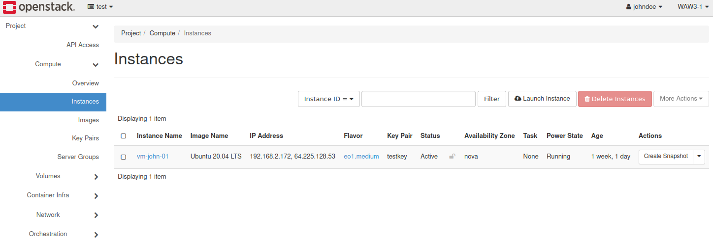
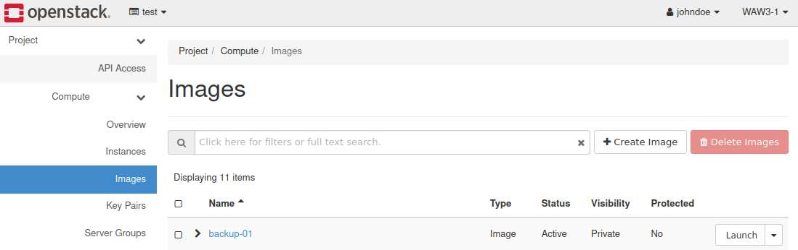
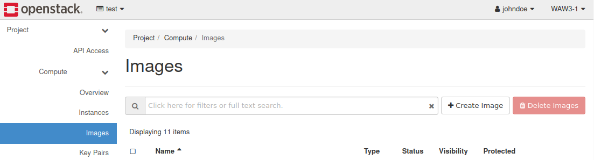
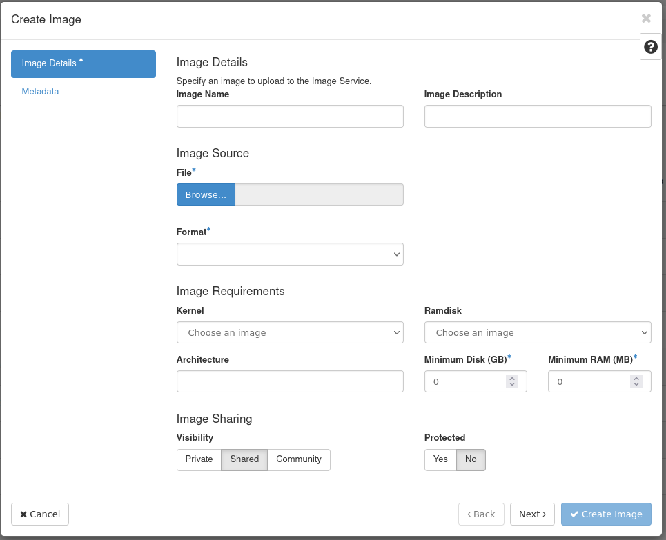
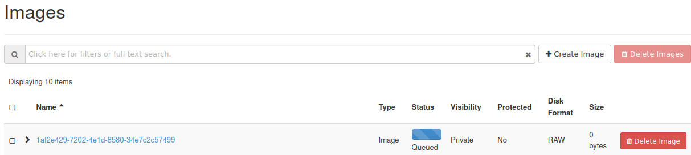

.. _my-reference-label:

How to backup an instance and download it to the desktop?
=========================================================

You should first prepare the python environment on your desktop.

Please see the following links:

`HOW TO INSTALL OPENSTACKCLIENT (LINUX)? <https://cloudferro-cf3.readthedocs-hosted.com/en/latest/openstackcli/openstacklinux/openstacklinux.html>`_ 

`HOW TO INSTALL OPENSTACKCLIENT (WINDOWS)? GITBASH/CYGWIN? <https://cloudferro-cf3.readthedocs-hosted.com/en/latest/openstackcli/openstackwindows/openstackwindows.html>`_ 
 

Assume that we created an instance *vm-john-01*.

Using CLI you can list the instances in your project.

.. code::

   user@ubuntu:~$ openstack server list
   +--------------------------------------+------------+--------+-------------------------------------------+------------------+------------+
   | ID                                   | Name       | Status | Networks                                  | Image            | Flavor     |
   +--------------------------------------+------------+--------+-------------------------------------------+------------------+------------+
   | 72170eb7-cee4-41a3-beea-c7d208446130 | vm-john-01 | ACTIVE | test_network=192.168.2.172, 64.225.128.53 | Ubuntu 20.04 LTS | eo1.medium |
   +--------------------------------------+------------+--------+-------------------------------------------+------------------+------------+

   
 
Now you can create a backup from CLI:

.. code::

   user@ubuntu:~$ openstack server backup create --name backup-01 72170eb7-cee4-41a3-beea-c7d208446130
   

If you want to have control over the number of stored backups, to the above command you should add the --rotate<count> parameter:

.. code::

   user@ubuntu:~$ openstack server backup create --name backup-01 --rotate 2 72170eb7-cee4-41a3-beea-c7d208446130 
   
You can see the backup "backup-01" in https://horizon.cloudferro.com/project/images

or in CLI:

.. code::

   user@ubuntu:~$ openstack image list --private
   +--------------------------------------+-----------+--------+
   | ID                                   | Name      | Status |
   +--------------------------------------+-----------+--------+
   | 747d720d-a6f4-4554-bf56-16183e5fb7fa | backup-01 | active |
   +--------------------------------------+-----------+--------+
   

Now you can download the image to your desktop

.. code::

   user@ubuntu:~$ openstack image save --file backup-on-the-desktop 747d720d-a6f4-4554-bf56-16183e5fb7fa
   

After that, you can upload backup file using dashboard:

 

Go to **Project → Compute → Images**.

Click **"Create Image"**.

On this panel you must insert image name, choose backup file and backup format. Next click "Create Image".

You can also use CLI to upload backup file:

.. code::
   
   user@ubuntu:~$ openstack image create --file path/to/backup <backup_name>

   
   

