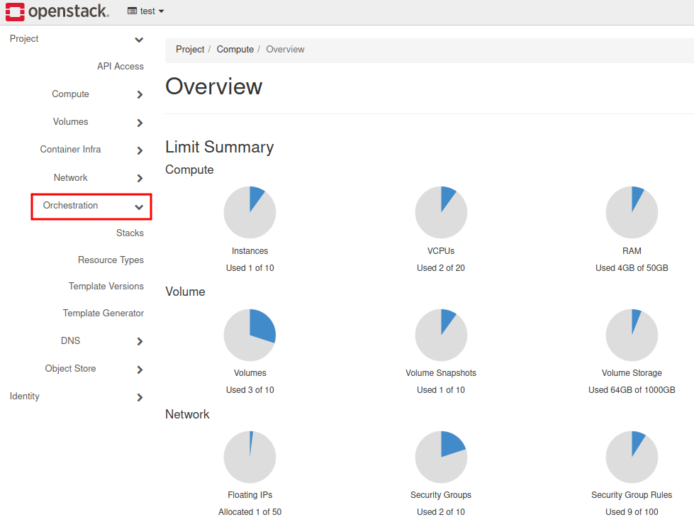
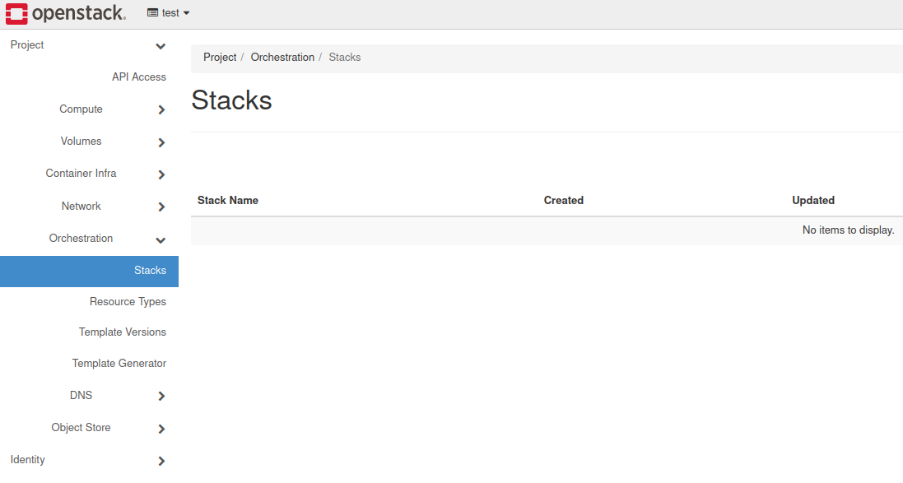
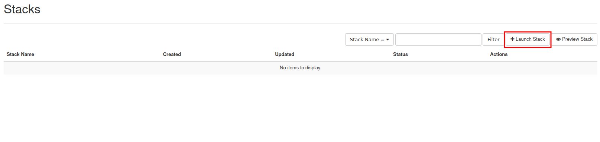
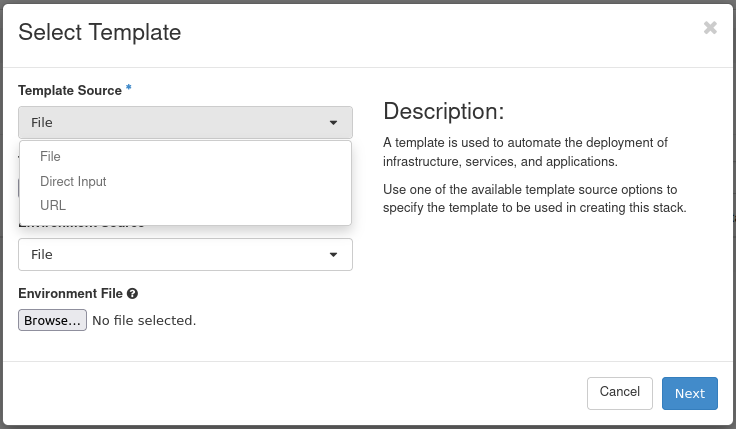

How to create a set of VMs using OpenStack Heat (Orchestration)?
=================================================================

Heat is an OpenStack component responsible for Orchestration. Its purpose is to deliver automation engine and optimize processes.
Heat uses templates in most-popular for devops culture syntax → yaml. Those templates describe the whole infrastructure that you are able to deploy. The deployed environment is being called stack. It can consists of many different resources.

You can leverage Heat templates using python-heatclient in CLI or using Horizon dashboard in the web browser.

**CLI**

For installing python-heatclient run pip command (strongly recommended virtual environment activated):

::

   pip install python-heatclient

To run a prepared template in order to deploy a stack, you have to use this command:

::

   openstack stack create -t template.yml <stackname>
 
   -t : assign template for deployment
 
   <stackname>: defines a name for the stack

**GUI**

Log in to the Horizon dashboard and choose **Orchestration** tab.

Click on the **Stacks**.

Navigate to the right part of the screen and choose **“Launch Stack”**.

Enroll Template Source selector and choose a particular file, Direct Input or URL to your template.

**Basic template**

Using this snippet, you can create one virtual machine, booted from ephemeral disk.

::

   heat_template_version: 2015-04-30       
                                        
   resources:                              
     instance:                             
       type: OS::Nova::Server              
       properties:                         
         flavor: eo1.xsmall                
         image: Ubuntu 18.04 LTS (19.18)
         networks:                         
           - network: private_network_0XXXX
           - network: eodata               
         key_name: your_key
         security_groups:
           - allow_ping_ssh_rdp
           - default     
                                            

**Explanation**

**heat_template_version** → strictly a version of heat template. Each of them varies in many ways (including different modules support, more parameters customization etc.)

**resources** → entry to commence providing particular components for deployment

**instance** → name of resource (you can type in anything on your own)

**type** → definition of an OpenStack component (a comprehensive list: https://docs.openstack.org/heat/latest/template_guide/openstack.html)

**properties** → under this tab provide required parameters for deploying an component (in the case of virtual machine such as flavor, image networks etc.)

.. note::

   Please customize the filled-in values for your project purposes.

.. attention::

   Check if you are using tabs for indentation. YAML doesn’t allow tabs; it requires spaces.

**More advanced template**

In this example, we will attach parameters, ResourceGroup with counter, VM booted from Cinder Volume and predefined outputs.

::

   heat_template_version: 2015-04-30
   
   parameters:
       key_name:
           type: string
           label: Key Name
           description: SSH key to be used for all instances
           default: your_key
       image_id:
           type: string
           label: Image ID
           description: Image to be used. Check all available options in Horizon dashboard or by using openstack image list command.
           default: Ubuntu 18.04 LTS (19.18)
       private_net_id:
           type: string
           description: ID/Name of private network
           default: private_network_0XXXX
       eodata_net_id:
           type: string
           description: ID/Name of eodata network
           default: eodata

   resources:
           Group_of_VMs:
                   type: OS::Heat::ResourceGroup
                   properties:
                           count: 2
                           resource_def:
                                   type: OS::Nova::Server
                                   properties:
                                           name: my_vm%index%
                                           flavor: eo1.xsmall
                                           image: { get_param: image_id }
                                           networks:
                                                   - network: { get_param: private_net_id }
                                                   - network: { get_param: eodata_net_id }
                                           key_name: { get_param: key_name }
                                           security_groups:
                                                   - allow_ping_ssh_rdp
                                                   - default

           VOL_FAQ:
                   type: OS::Cinder::Volume
                   properties:
                           name: vol
                           size: 20
                           image : { get_param: image_id }

           With_volume:
                   type: OS::Nova::Server
                   properties:
                           flavor: eo1.xsmall
                           block_device_mapping: [{"volume_size": 20, "volume_id": { get_resource: VOL_FAQ }, "delete_on_termination": False, "device_name": "/dev/vda" }]
                           networks:
                                    - network: { get_param: private_net_id }
                                    - network: { get_param: eodata_net_id }
                           key_name: { get_param: key_name }
                           security_groups:
                                    - allow_ping_ssh_rdp
                                    - default
                           image : { get_param: image_id }

   outputs:
           SERVER_DETAILS:
                   description: Shows details of all virtual servers.
                   value: { get_attr: [ Group_of_VMs, show ] }  
                   
.. note::

   As you can see,  firstly you have to create a real volume (called VOL_FAQ). After that you can proceed to create a VM (With_volume).
   
**Explanation**

**Parameters** →  a solution to provide default values, which you can later inject into resource defintions using {get param: param_name }

**ResourceGroup** → component being used for repeating deployment, e.g two identical VM’s

**Count** → defines a variable for iterative operations

**resource_def** → starting statement for defining group resources

**%index%** → in this way we can easily add iterative number to the VM name, increasing values starting from 0.

**block_device_mapping** → property to define a bootable Cinder volume for instance

**outputs** → Additional information concerning deployed elements of the stack. In this case it returns a “show” attribute output. You can examine this kind of information by using openstack stack output list. Available attributes for every component can be found here: https://docs.openstack.org/heat/latest/template_guide/openstack.html

.. note::

   Please customize the filled-in values for your project purposes.
   
**Documentation**

https://docs.openstack.org/heat/latest/getting_started/create_a_stack.html

https://docs.openstack.org/heat/rocky/template_guide/hot_guide.html

https://docs.openstack.org/heat/latest/template_guide/hot_spec.html
