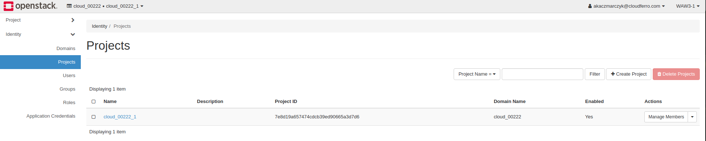

How to create and configure new project in OpenStack?
=====================================================

In this howto article I would like to show how OpenStack user can manage own projects using Horizon Dashboard, the fastest and most convenient way to mantain.

Creating new project:

Let's start with choosing Identity → Projects menu on the left side of the screen.

Click on "Create Project" button.

You will be asked for name (obligatory) and description for the new project. Leave checkbox "Enable" ticked if you want your project become active.

Next, switch on the "Project Members" tab.

You can add to project users from user list by clicking the "+" icon. Next, it is possible to grant privileges for all members in project by selecting proper role from drop-down menu. (Please note that "heat_stack_user", "cf_associate" and "admin" ARE STRONGLY NOT RECOMMENDED)
Here you can check how to add new users to your project.

The last tab allows us to add whole groups of users with the same privileges. Currently adding new users to group is not supported by Horizon.

To finish setup of the new project, click on the blue "Create Project" button.

If you set the configuration properly, new project should appear on the list.

Now, using the drop-down menu, you can modify groups (the last tab from setup), edit project (whole setup process will appear again), delete project, and set your project as active.

When you choose the last option, your recent project will be changed to current one. You will see it at the bar on the top of the page.

If you want to check your project ID, just open Project → API Access menu, and click on "View Credentials"
