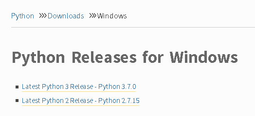
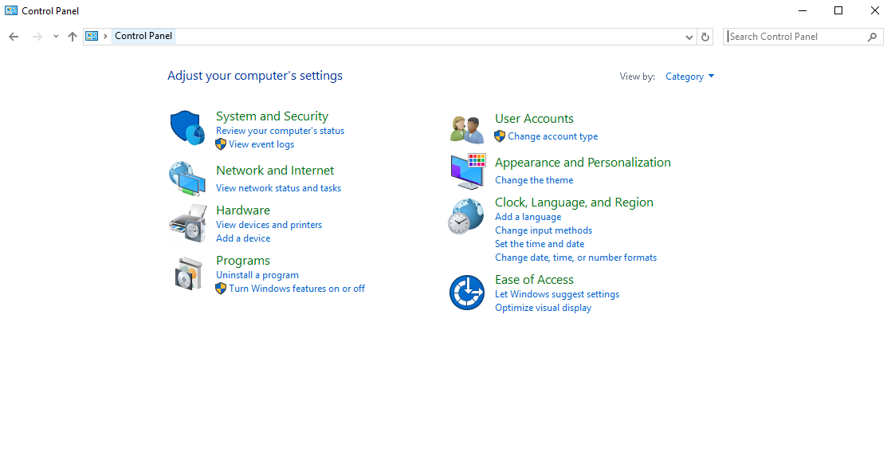
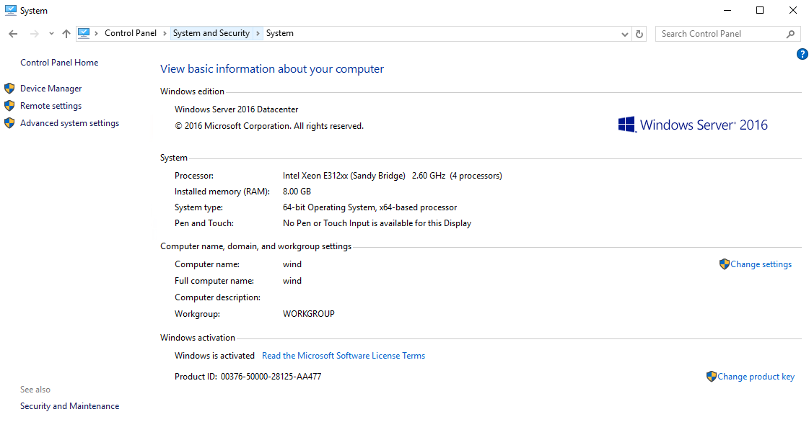
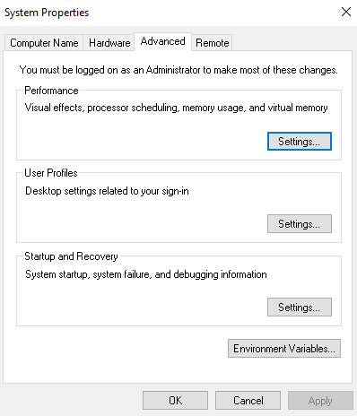
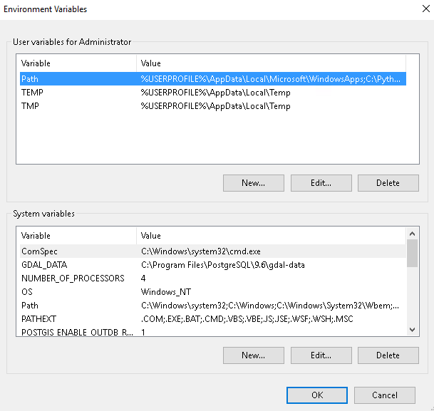
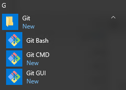
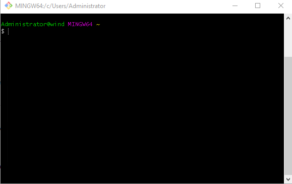
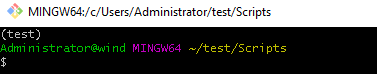

How to install OpenStackClient (Windows)? GitBash/Cygwin
========================================================

**OpenStackClient** is very useful tool to gain a powerful management of our projects in Command Line Interface.It implements new features and advantages: You can run the commands from the CLI, or include prepared scripts in Python to automate the functionality of your cloud storage.Moreover we could reach our OpenStack access on any computer if we inset credentials (username and password).

Eventually everyone may admit that generally OpenStackClient provides more opportunities to look into our compute facility deeply and much more precisely.

In **Microsoft Family Systems** the case of implementation of serviceable CLI client is more complicated than in Linux Distributions. Configuration file for Openstack is not prepared for clear injection into **CMD** or **Powershell** and the "export" syntax is not recognized. Hence we need to install bash emulators.

To supply our operating system into Manageable OpenstackClient we have to accessorize our Windows in:

List
----

 * Python 2 or 3 ( this tutorial is prepared for 2.7.8 version)

 * Pip (tool for installing python packages)

 * GIT for Windows or Cygwin64 Terminal

 * Microsoft Visual C++ Compiler for Python 2.7

Let's start with the **Python** Installation. Move on to official website with all stable releases:

Step One
--------

https://www.python.org

Head to **Downloads** and next to **Windows** while the list is currently enrolled.

Pick up the latest version for Python 2. In our case it is seen 2.7.15.

Go through the installation process normally. Default location for Python will be placed in your OS partition C:  such as:

.. code:: 

	C:\Python27

Step Two
--------

To simplify our actions with Python and its dependencies we need to set up environmental variables.

Move on to our control panel:

Go straight through the main category **System and Security** and next click on the **System** tab

The left panel consists of three options. Choose **Advanced system settings**.

In the **system properties** pop-up window choose **Environment Variables**:

In current **state** we should be able to take a look at two tables

.. code::

    User variables for Administrator
    System variables

We are interested in the blue-captured variable **Path**. Click the "**Edit**" button below three records: Path,TEMP and TMP

Add three rows to the Path:

.. code::

	#Python localization
	C:\Python27
	#virtualenv localization(we will be using this package to implement environments for python)
	C:\Python27\Lib\source-packages\
	#pip localization
	C:\Python27\Scripts\

Confirm applied changes and close all remaining windows.

Step Three
-----------

Download and install **GIT for Windows** to emulate terminal. It allow to use typical and straighly-used linux commands like: ls, source, vim etc. It has the major role in our exercise in the final stage.

https://gitforwindows.org

After installation you should acquire three GIT extensions:

.. code::

    Bash
    CMD
    GUI

From this instance use GIT Bash till the end to run commands and .sh files.

Download the **get-pip.py**

https://bootstrap.pypa.io/get-pip.py

Go to the Downloads directory and execute the command:

.. code::

	python get-pip.py

Now we are handling a useful tool to manage and install **python packages**.

Occasionally we may want to check if everything is alright. Type in an example:

.. code::

	pip -V

If we got an output answer about **pip version** we might assume a half of our success.

It is strongly important to include this command. It update our PythonSSL certification which is being checked during pip package installations:
pip install -U requests[security]

Furthermore we should implement visual c++ compiler for python 2.7

https://www.microsoft.com/en-us/download/details.aspx?id=44266

Change your **directory** to C:\Users\Administrator and install virtual environment package

.. code::

	pip install virtualenv

Syntax for creating a new **environment**:

#virtualenv (name)
virtualenv test

A new directory should appear in our current folder

To use **test** env we need to run activate file.

.. code::

	cd test/Scripts
	source Activate

Environment is **active**.

Step Four
---------

Install **python-openstackclient** in our separated test environment:

.. code::

	pip install python-openstackclient

Download your **rc v3 file** from your horizon panel. Precised instruction is presented in the "Python Openstackclient for Linux"

Now we need to add two additional lines to our file to proceed the authorization process.

.. code::

	vim (file_name)

The rows you need to type in are:

.. code::

	export OS_VOLUME_API_VERSION=2
	export OS_IMAGE_API_VERSION=2

Save and **source** your rc file.

.. code::

	source (file_name)

Enter your **password**

Every **credentials** has been equipped. From the theoretical point view we should be able to enter openstack commands associated with our projects.

Type in:

.. code::

	openstack server list

The provisioned **table** in your console should appear without any bad circumstances.

If you experience **HTTP 400** error then your rc file has got a problem with a **variables** (check if you added necessary records)

If you experience **HTTP 401** error then you probably typed in wrong password. Repeat your source command.

More manuals for Windows you can find `here <https://creodias.eu/knowledgebase?_3_formDate=1592551468543&p_p_id=3&p_p_lifecycle=0&p_p_state=maximized&p_p_mode=view&_3_struts_action=%2Fsearch%2Fsearch&_3_cur=1&_3_format=&_3_entryClassName=&_3_assetCategoryIds=&_3_assetTagNames=windows>`_.
