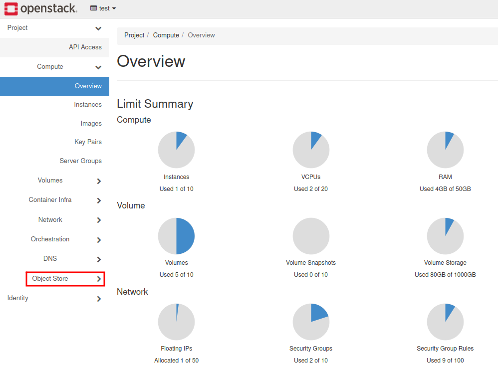
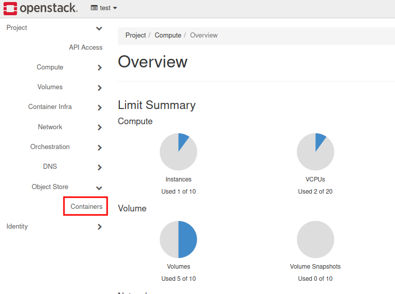
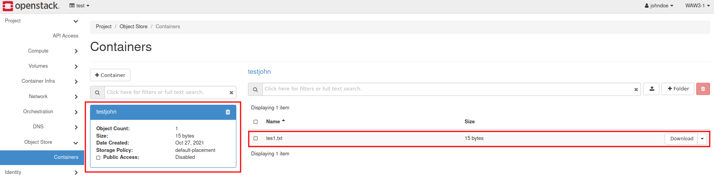

How to mount object storage container as a file system in Linux using s3fs?
===========================================================================

If you want to create new Object Storage container, follow this guide: `How To Use Object Storage? <https://cloudferro-cf3.readthedocs-hosted.com/en/latest/s3/objectstorage/objectstorage.html>`_

To mount your Object Storage container as file system do following steps:

Check if the s3fs is preinstalled on your virtual machine:

::

   eouser@vm1:~$ whereis s3fs
   s3fs: /usr/local/bin/s3fs

Provide access and secret key to the .passwd-s3fs file in your home directory:

::

   eouser@vm1:~$ echo access_key:secret_key>~/.passwd-s3fs

For obtaining ec2 credentials please follow this FAQ: `How to generate ec2 credentials? <https://cloudferro-cf3.readthedocs-hosted.com/en/latest/general/generateec2/generateec2.html>`_ or send a request to the support by creating a new ticket in the https://creodias.eu.

Change the permissions for the file with stored credentials:

::

   eouser@vm1:~$ chmod 600 ~/.passwd-s3fs

Make an folder which you would like to use as mount place of the bucket:

::

   eouser@vm1:~$ mkdir directory

Mount a container using s3fs:

::

   eouser@vm1:~$ /usr/local/bin/s3fs testjohn directory -o passwd_file=~/.passwd-s3fs -o url=https://s3.waw3-1.cloudferro.com -o use_path_request_style -o umask=0002 -o allow_other

Parameters explanation:

**-o passwd file** = describe the path to the file with credentials

**-o url** = describe an endpoint address of your private object storage

**-o use path_request style** = parameter that already fix issues with special characters such as dots.

**-o umask** = describe permissions for accessing a container (read-write-execute)

**-o allow_other** = the rule that allow other users to gain access to the container

If you do not proceed an operation as a root user, you may encounter an error such as:

.. warning::
   fusermount: option allow_other only allowed if 'user_allow_other' is set in /etc/fuse.conf
   
In this case, open **/etc/fuse.conf** file by using text editor, e.g. nano

::
   
   eouser@vm1:~$ sudo nano /etc/fuse.conf

and search for the line:

::

   # Allow non-root users to specify the allow_other or allow_root mount options.

   #user_allow_other

Uncomment user_allow_other by deleting #:

::

   user_allow_other

Save the file.

Now you might repeat a mount command

::

   eouser@vm1:~$ /usr/local/bin/s3fs testjohn directory -o passwd_file=~/.passwd-s3fs -o url=https://s3.waw3-1.cloudferro.com -o use_path_request_style -o umask=0002 -o allow_other

After that, go to the directory where your bucket is being mounted and list all the data inside:

::

   eouser@vm1:~$ cd directory/
   eouser@vm1:~/directory$ ls -al
   total 5
   drwxrwxr-x 1 eouser eouser    0 Jan  1  1970 .
   drwxr-xr-x 8 eouser eouser 4096 Oct 27 07:05 ..
   -rwxrwxr-x 1 eouser eouser   15 Oct 27 07:17 tes1.txt
  
It have found a one file: **tes1.txt**. To make sure about its existence, log in to your Horizon Panel and click on the **Object Store** tab:

Choose **“Containers”**.

Click on the container. In this case it’s being called **“testjohn”**.

On your right are files, that are stored inside the bucket.
   
 
   
