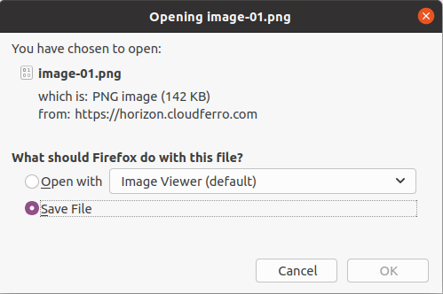
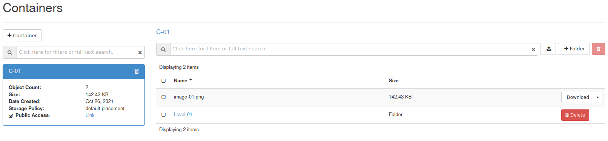

How to use Object Storage?
==========================

.. warning::

   It is highly advisable to put not more than 1 Mil (1 000 000) objects into one bucket (container).
   More objects makes listing of the objects very inefficient.
   We suggest to create many buckets with small amount of objects instead of small amount of buckets with many objects.
   
Be sure that you are **signed in**.

Go to: https://horizon.cloudferro.com/auth/login/?next=/

Choose the project. In that case we have just one project available named **"test"**.

Open the **"Object Store"** pane

Choose **"Containers"**

Click **"+ Container"** button

Give the container a name "eg. C-01"

If you want to make the container available outside of your project, check **"Public"** checkbox and click **"Submit"** button

You can now enter the container by clicking on "C-01" button

To upload the files to the container, click the **"Upload file"** button

You can use **"Browse"** button to choose the file you want to upload from your file system

You can share the link to the uploaded object by clicking **"Link"**

A link similar to this will be created:

:samp:`https://s3.waw3-1.cloudferro.com/swift/v1/AUTH_f22a47c247fc4372a00a0d0d794fbb32/C-01/image-01.pnga`

.. note::

   Links come and go and it is quite probable that this link is no longer valid at the moment you are reading this article. It only serves as an example of what you might get within this procedure. 

Now anybody who knows the link can download the object

You can add folders in the container and upload objects to the new folders

You can create subfolders as well

You can add more objects on various levels

